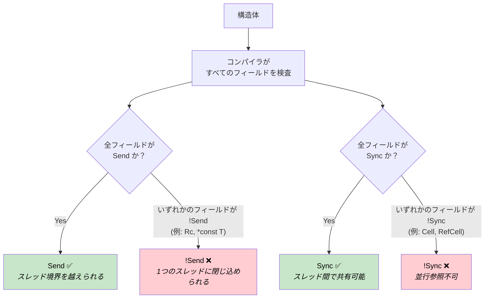
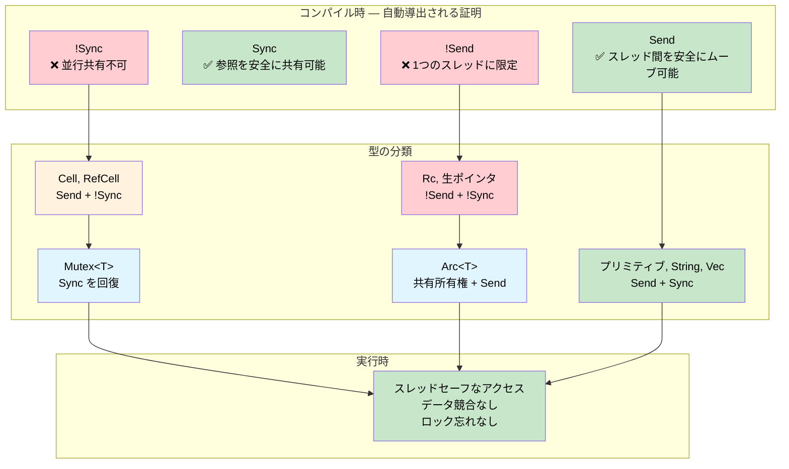

# Send と Sync — コンパイル時並行性証明 🟠

> **学習内容:** Rust の `Send` と `Sync` 自動トレイト（auto-traits）がどのようにコンパイラを並行性監査役へと変え、どの型がスレッド境界を越えられ、どの型が安全に共有できるかを実行時コストゼロでコンパイル時に証明するのかを学びます。
>
> **関連章:** [第4章](ch04-capability-tokens-zero-cost-proof-of-aut.md)（ケーパビリティトークン）、[第9章](ch09-phantom-types-for-resource-tracking.md)（幽霊型（ファントム型））、[第15章](ch15-const-fn-compile-time-correctness-proofs.md)（const fn による証明）

## 問題: セーフティネットのない並行アクセス

システムプログラミングにおいて、ペリフェラル、共有バッファ、グローバル状態は複数のコンテキスト（メインループ、割り込みハンドラ、DMA コールバック、ワーカースレッドなど）からアクセスされます。C 言語では、コンパイラは強制力のある保護を一切提供しません：

```c
/* 共有センサーバッファ — メインループと ISR からアクセスされる */
volatile uint32_t sensor_buf[64];
volatile uint32_t buf_index = 0;

void SENSOR_IRQHandler(void) {
    sensor_buf[buf_index++] = read_sensor();  /* レース: buf_index の読み取り + 書き込み */
}

void process_sensors(void) {
    for (uint32_t i = 0; i < buf_index; i++) {  /* ループの途中で buf_index が変化する */
        process(sensor_buf[i]);                   /* 読み取りの途中でデータが上書きされる */
    }
    buf_index = 0;                                /* これらの行の合間に ISR が発火する */
}
```

`volatile` キーワードはコンパイラが読み取りを最適化で消去することを防ぎますが、データ競合（data race）については**何も**対策しません。2つのコンテキストが同時に `buf_index` を読み書きでき、値の引き裂かれ（torn values）、更新の喪失、バッファオーバーランを引き起こします。同様の問題は `pthread_mutex_t` でも発生します — コンパイラはロックの取得を忘れても平気で見逃します：

```c
pthread_mutex_t lock;
int shared_counter;

void increment(void) {
    shared_counter++;  /* しまった — pthread_mutex_lock(&lock) を忘れた */
}
```

**すべての並行性バグは実行時に発見されます** — 通常は高負荷時や本番環境で、断続的に発生します。

## Send と Sync が証明するもの

Rust はコンパイラが自動的に導出する2つのマーカートレイトを定義しています：

| トレイト | 証明内容 | 直感的な意味 |
|-------|-------|-------------------|
| `Send` | 型 `T` の値が別のスレッドに安全に**ムーブ**できること | 「スレッド境界を越えられる」 |
| `Sync` | **共有参照** `&T` を複数のスレッドで安全に使用できること | 「複数のスレッドから安全に読み取れる」 |

これらは**自動トレイト（auto-traits）**です — コンパイラはすべてのフィールドを検査することによってこれらを導出します。ある構造体のすべてのフィールドが `Send` であれば、その構造体も `Send` になります。すべてのフィールドが `Sync` であれば、その構造体も `Sync` になります。いずれかのフィールドが除外（オプトアウト）されていれば、構造体全体が除外されます。アノテーションは不要で、実行時オーバーヘッドもありません — 証明は構造的です。



> **コンパイラ自身が監査役です。** C 言語では、スレッドセーフに関する注記はコメントやヘッダーのドキュメントに記載されますが、これらは推奨にすぎず強制されることは決してありません。Rust では、`Send` と `Sync` は型自体の構造から導出されます。`Cell<f32>` フィールドを1つ追加するだけで、それを含む構造体は自動的に `!Sync` になります。プログラマ側の操作は不要で、忘れる余地もありません。

この2つのトレイトは重要な恒等関係によって結ばれています：

> **`T` が `Sync` であることと、`&T` が `Send` であることは同値である。**

これは直感的に理にかなっています：もし共有参照を安全に別のスレッドに送信できるのであれば、元の型は並行な読み取りに対して安全であることになります。

### オプトアウトする型

特定の型は意図的に `!Send` または `!Sync` になっています：

| 型 | Send | Sync | 理由 |
|------|:----:|:----:|-----|
| `u32`, `String`, `Vec<T>` | ✅ | ✅ | 内部可変性がなく、生ポインタも持たない |
| `Cell<T>`, `RefCell<T>` | ✅ | ❌ | 同期機構のない内部可変性 |
| `Rc<T>` | ❌ | ❌ | 参照カウントがアトミックではない |
| `*const T`, `*mut T` | ❌ | ❌ | 生ポインタには安全性保証がない |
| `Arc<T>`（`T: Send + Sync` の場合） | ✅ | ✅ | アトミックな参照カウント |
| `Mutex<T>`（`T: Send` の場合） | ✅ | ✅ | ロックがすべてのアクセスを直列化する |

この表のすべての ❌ は**コンパイル時の不変条件**です。誤って `Rc` を別のスレッドに送信することはできません — コンパイラがそれを拒否します。

## !Send なペリフェラルハンドル

組み込みシステムでは、ペリフェラルレジスタブロックは固定メモリ空間に配置され、単一の実行コンテキストからのみアクセスされるべきです。生ポインタは本質的に `!Send` かつ `!Sync` であるため、生ポインタをラップするだけで、それを含む型も両方のトレイトから自動的にオプトアウトされます：

```rust
/// メモリマップド UART ペリフェラルへのハンドル。
/// 生ポインタにより、これは自動的に !Send かつ !Sync になる。
pub struct Uart {
    regs: *const u32,
}

impl Uart {
    pub fn new(base: usize) -> Self {
        Self { regs: base as *const u32 }
    }

    pub fn write_byte(&self, byte: u8) {
        // 実際のファームウェアでは: unsafe { write_volatile(self.regs.add(DATA_OFFSET), byte as u32) }
        println!("UART TX: {:#04X}", byte);
    }
}

fn main() {
    let uart = Uart::new(0x4000_1000);
    uart.write_byte(b'A');  // ✅ 作成したスレッド上で使用

    // ❌ コンパイル不可: Uart は !Send
    // std::thread::spawn(move || {
    //     uart.write_byte(b'B');
    // });
}
```

コメントアウトされた `thread::spawn` は次のエラーを発生させます：

```text
error[E0277]: `*const u32` cannot be sent between threads safely
   |
   |     std::thread::spawn(move || {
   |     ^^^^^^^^^^^^^^^^^^ within `Uart`, the trait `Send` is not
   |                        implemented for `*const u32`
```

**生ポインタがない場合は？`PhantomData` を使用します。**
型が生ポインタを持たない場合でも、1つのスレッドに限定したいことがあります — たとえば、ファイルディスクリプタのインデックスや、C ライブラリから取得したハンドルの場合です：

```rust
use std::marker::PhantomData;

/// C ライブラリからの不透明な（opaque）ハンドル。PhantomData<*const ()> により、
/// 内部の fd が単なる整数であっても !Send + !Sync になる。
pub struct LibHandle {
    fd: i32,
    _not_send: PhantomData<*const ()>,
}

impl LibHandle {
    pub fn open(path: &str) -> Self {
        let _ = path;
        Self { fd: 42, _not_send: PhantomData }
    }

    pub fn fd(&self) -> i32 { self.fd }
}

fn main() {
    let handle = LibHandle::open("/dev/sensor0");
    println!("fd = {}", handle.fd());

    // ❌ コンパイル不可: LibHandle は !Send
    // std::thread::spawn(move || { let _ = handle.fd(); });
}
```

これは、C 言語における「このハンドルはスレッドセーフではないと記載されたドキュメントを読んでください」という注記のコンパイル時版です。Rust では、コンパイラがそれを強制します。

## Mutex が !Sync を Sync に変換する

`Cell<T>` や `RefCell<T>` は一切の同期なしで内部可変性を提供するため、`!Sync` です。しかし、場合によってはスレッド間で可変な状態を本当に共有する必要があります。`Mutex<T>` は欠けている同期機構を追加し、コンパイラはこれを認識します：

> **`T: Send` であれば、`Mutex<T>: Send + Sync` である。**

ロックがすべてのアクセスを直列化（シリアライズ）するため、`!Sync` な内部型を安全に共有できるようになります。コンパイラはこれを構造的に証明します — 「プログラマがロックを取得し忘れていないか」をチェックする実行時オーバーヘッドはありません：

```rust
use std::sync::{Arc, Mutex};
use std::cell::Cell;

/// 内部可変性のために Cell を使用するセンサーキャッシュ。
/// Cell<u32> は !Sync — スレッド間で直接共有することはできない。
struct SensorCache {
    last_reading: Cell<u32>,
    reading_count: Cell<u32>,
}

fn main() {
    // Mutex により SensorCache を安全に共有できるようになる — コンパイラがそれを証明
    let cache = Arc::new(Mutex::new(SensorCache {
        last_reading: Cell::new(0),
        reading_count: Cell::new(0),
    }));

    let handles: Vec<_> = (0..4).map(|i| {
        let c = Arc::clone(&cache);
        std::thread::spawn(move || {
            let guard = c.lock().unwrap();  // アクセス前に必ずロックを取得しなければならない
            guard.last_reading.set(i * 10);
            guard.reading_count.set(guard.reading_count.get() + 1);
        })
    }).collect();

    for h in handles { h.join().unwrap(); }

    let guard = cache.lock().unwrap();
    println!("Last reading: {}", guard.last_reading.get());
    println!("Total reads:  {}", guard.reading_count.get());
}
```

C 言語のバージョンと比較してみてください：`pthread_mutex_lock` はプログラマが呼び忘れかねない実行時呼び出しです。ここでは、型システムによって `Mutex` を経由せずに `SensorCache` にアクセスすることが不可能になっています。証明は構造的であり、唯一の実行時コストはロックそのものだけです。

> **`Mutex` は単に同期を行うだけでなく、同期されていることを証明します。** `Mutex::lock()` は `&T` へ `Deref` する `MutexGuard` を返します。ロックを経由せずに内部データへの参照を取得する方法はありません。この API は「ロックの忘れ」を構造的に表現不可能にしています。

## 定理としての関数境界（Function Bounds）

`std::thread::spawn` は次のシグネチャを持っています：

```rust,ignore
pub fn spawn<F, T>(f: F) -> JoinHandle<T>
where
    F: FnOnce() -> T + Send + 'static,
    T: Send + 'static,
```

`Send + 'static` というトレイト境界は単なる実装の詳細ではなく、**定理**です：

> 「`spawn` に渡される任意のクロージャと戻り値は、ダングリング参照を持たず、別のスレッドで安全に実行できることがコンパイル時に証明されている。」

自身の API にも同じパターンを適用できます：

```rust
use std::sync::mpsc;

/// バックグラウンドスレッドでタスクを実行し、その結果を返す。
/// トレイト境界が証明すること: クロージャとその結果はスレッドセーフである。
fn run_on_background<F, T>(task: F) -> T
where
    F: FnOnce() -> T + Send + 'static,
    T: Send + 'static,
{
    let (tx, rx) = mpsc::channel();
    std::thread::spawn(move || {
        let _ = tx.send(task());
    });
    rx.recv().expect("background task panicked")
}

fn main() {
    // ✅ u32 は Send であり、クロージャは非 Send なものをキャプチャしない
    let result = run_on_background(|| 6 * 7);
    println!("Result: {result}");

    // ✅ String は Send
    let greeting = run_on_background(|| String::from("hello from background"));
    println!("{greeting}");

    // ❌ コンパイル不可: Rc は !Send
    // use std::rc::Rc;
    // let data = Rc::new(42);
    // run_on_background(move || *data);
}
```

`Rc` の例のコメントを解除すると、的確な診断メッセージが出力されます：

```text
error[E0277]: `Rc<i32>` cannot be sent between threads safely
   --> src/main.rs
    |
    |     run_on_background(move || *data);
    |     ^^^^^^^^^^^^^^^^^^ `Rc<i32>` cannot be sent between threads safely
    |
note: required by a bound in `run_on_background`
    |
    |     F: FnOnce() -> T + Send + 'static,
    |                        ^^^^ required by this bound
```

コンパイラは違反の原因を正確な境界まで遡り、プログラマに*なぜ*ダメなのかを伝えます。C 言語の `pthread_create` と比較してみてください：

```c
int pthread_create(pthread_t *thread, const pthread_attr_t *attr,
                   void *(*start_routine)(void *), void *arg);
```

`void *arg` はスレッドセーフであろうとなかろうと、あらゆるものを受け取ってしまいます。C コンパイラは非アトミックな参照カウントと単なる整数を区別できません。Rust のトレイト境界は、型レベルでこの区別を行います。

## いつ Send/Sync による証明を使用すべきか

| シナリオ | アプローチ |
|----------|----------|
| 生ポインタをラップしたペリフェラルハンドル | 自動的に `!Send + !Sync` — 何もする必要なし |
| C ライブラリからのハンドル（整数の fd/ハンドル） | `!Send + !Sync` にするために `PhantomData<*const ()>` を追加 |
| ロック配下の共有設定 | `Arc<Mutex<T>>` — コンパイラがアクセスが安全であることを証明 |
| スレッド間のメッセージパッシング | `mpsc::channel` — `Send` 境界が自動的に強制される |
| タスクスポウナーやスレッドプール API | シグネチャで `F: Send + 'static` を要求 |
| 単一スレッド専用リソース（例: GPU コンテキスト） | 共有を防止するために `PhantomData<*const ()>` を使用 |
| 型を `Send` にしたいが生ポインタを含んでいる | 安全性の根拠を文書化した上で `unsafe impl Send` |

### コストのまとめ

| 項目 | 実行時コスト |
|------|:------:|
| `Send` / `Sync` の自動導出 | コンパイル時のみ — 0 バイト |
| `PhantomData<*const ()>` フィールド | ゼロサイズ — 最適化で消去 |
| `!Send` / `!Sync` の強制 | コンパイル時のみ — 実行時チェックなし |
| `F: Send + 'static` 関数境界 | 単相化 — 静的ディスパッチ、ボクシングなし |
| `Mutex<T>` ロック | 実行時ロック（共有可変性には不可避） |
| `Arc<T>` 参照カウント | アトミックなインクリメント/デクリメント（共有所有権には不可避） |

最初の4行は**ゼロコスト**です — 型システム内にのみ存在し、コンパイル後に消え去ります。`Mutex` と `Arc` には不可避な実行時コストが伴いますが、それらのコストは正しい並行プログラムが支払わなければならない*最小限*のコストです — Rust はそれを確実に支払わせるだけです。

## 演習: DMA 転送ガード

DMA 転送の実行中にバッファを保持する `DmaTransfer<T>` を設計してください。要件：

1. `DmaTransfer` は `!Send` でなければならない — DMA コントローラはこのコアのメモリバスに紐づく物理アドレスを使用する
2. `DmaTransfer` は `!Sync` でなければならない — DMA が書き込んでいる間の並行な読み取りは引き裂かれたデータを参照してしまう
3. ガードを**消費**してバッファを返却する `wait()` メソッドを提供する — 所有権が転送の完了を証明する
4. バッファ型 `T` は `DmaSafe` マーカートレイトを実装していなければならない

<details>
<summary>解答例</summary>

```rust
use std::marker::PhantomData;

/// DMA バッファとして使用できる型のためのマーカートレイト。
/// 実際のファームウェアでは: パディングのない repr(C) 型でなければならない。
trait DmaSafe {}

impl DmaSafe for [u8; 64] {}
impl DmaSafe for [u8; 256] {}

/// 実行中の DMA 転送を表すガード。
/// !Send + !Sync: 別のスレッドに送信することも共有することもできない。
pub struct DmaTransfer<T: DmaSafe> {
    buffer: T,
    channel: u8,
    _no_send_sync: PhantomData<*const ()>,
}

impl<T: DmaSafe> DmaTransfer<T> {
    /// DMA 転送を開始する。バッファは消費される — 他の誰も触れることはできない。
    pub fn start(buffer: T, channel: u8) -> Self {
        // 実際のファームウェアでは: DMA チャネルを設定し、転送元/転送先を指定して転送を開始
        println!("DMA channel {} started", channel);
        Self {
            buffer,
            channel,
            _no_send_sync: PhantomData,
        }
    }

    /// 転送の完了を待機し、バッファを返す。
    /// self を消費する — これ以降ガードは存在しなくなる。
    pub fn wait(self) -> T {
        // 実際のファームウェアでは: 完了するまで DMA ステータスレジスタをポーリング
        println!("DMA channel {} complete", self.channel);
        self.buffer
    }
}

fn main() {
    let buf = [0u8; 64];

    // 転送開始 — buf はガード内にムーブされる
    let transfer = DmaTransfer::start(buf, 2);

    // ❌ buf にはもうアクセスできない — 所有権が DMA 実行中の使用を防止する
    // println!("{:?}", buf);

    // ❌ コンパイル不可: DmaTransfer は !Send
    // std::thread::spawn(move || { transfer.wait(); });

    // ✅ 元のスレッドで待機し、バッファを取り戻す
    let buf = transfer.wait();
    println!("Buffer recovered: {} bytes", buf.len());
}
```

</details>



## 主なポイント

1. **`Send` と `Sync` は並行性の安全性に関するコンパイル時証明である** — コンパイラはすべてのフィールドを検査することで、これらを構造的に自動導出します。アノテーションも、実行時コストも、明示的なオプトインも不要です。

2. **生ポインタは自動的にオプトアウトする** — `*const T` または `*mut T` を含むあらゆる型は `!Send + !Sync` になります。これにより、ペリフェラルハンドルは自然にスレッド限定になります。

3. **`PhantomData<*const ()>` は明示的なオプトアウト手段** — 型が生ポインタを持たない場合でもスレッド限定にしたい場合（C ライブラリのハンドル、GPU コンテキスト）、幽霊フィールドがその役目を果たします。

4. **`Mutex<T>` は証明を伴って `Sync` を回復する** — コンパイラはすべてのアクセスがロックを経由することを構造的に証明します。C 言語の `pthread_mutex_t` とは異なり、ロックの取得を忘れることはできません。

5. **関数境界は定理である** — スポウナーのシグネチャにおける `F: Send + 'static` はコンパイル時の証明義務です: すべての呼び出し元は自身のクロージャがスレッドセーフであることを証明しなければなりません。何でも受け取ってしまう C 言語の `void *arg` と比較してみてください。

6. **このパターンは他のすべての正しさの技法を補完する** — 型状態（タイプステート）がプロトコルの順序を証明し、幽霊型がパーミッションを証明し、`const fn` が値の不変条件を証明し、`Send`/`Sync` が並行性の安全性を証明します。これらが合わさることで、正しさの領域全体が網羅されます。
