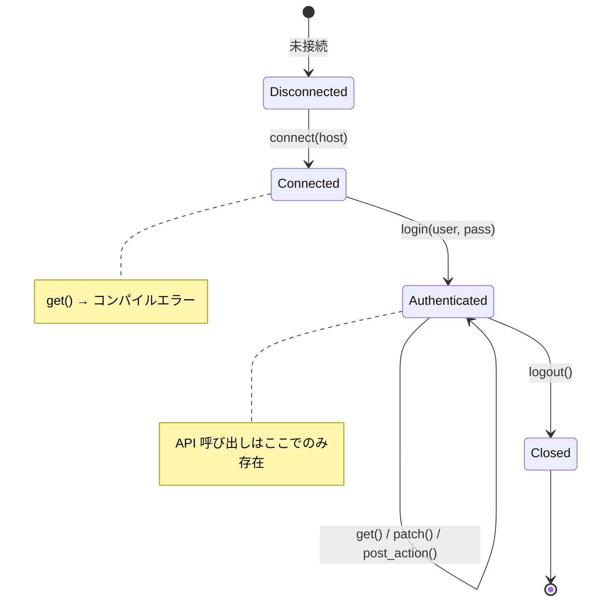
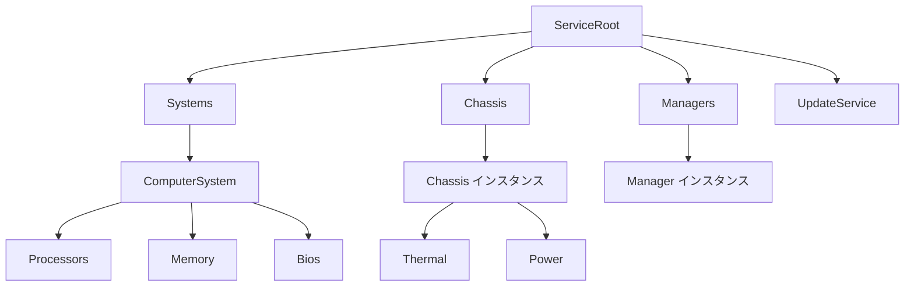
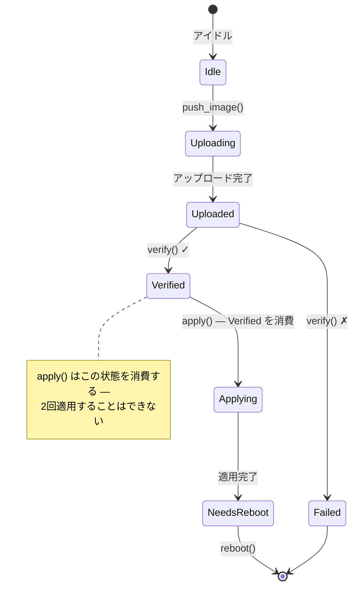

# 実践ウォークスルー — 型安全な Redfish クライアント 🟡

> **学習内容:** セッションの型状態（タイプステート）、ケーパビリティトークン、幽霊型（ファントム型）によるリソース探索、次元解析、検証済み境界、ビルダーの型状態、および使い捨て型を組み合わせて、すべてのプロトコル違反がコンパイルエラーになる完全かつオーバーヘッドゼロの Redfish クライアントを構築する方法を学びます。
>
> **関連章:** [第2章](ch02-typed-command-interfaces-request-determi.md)（型付きコマンド）、[第3章](ch03-single-use-types-cryptographic-guarantee.md)（使い捨て型）、[第4章](ch04-capability-tokens-zero-cost-proof-of-aut.md)（ケーパビリティトークン）、[第5章](ch05-protocol-state-machines-type-state-for-r.md)（型状態）、[第6章](ch06-dimensional-analysis-making-the-compiler.md)（次元型）、[第7章](ch07-validated-boundaries-parse-dont-validate.md)（検証済み境界）、[第9章](ch09-phantom-types-for-resource-tracking.md)（幽霊型）、[第10章](ch10-putting-it-all-together-a-complete-diagn.md)（IPMI 統合）、[第11章](ch11-fourteen-tricks-from-the-trenches.md)（裏技4 — ビルダーの型状態）

## なぜ Redfish は独立した章に値するのか

第10章では、バイトレベルのプロトコルである IPMI を中心にコアパターンを組み合わせました。しかし、最新の BMC プラットフォームの多くは、IPMI と並行して（あるいは IPMI の代わりに）**Redfish** REST API を公開しており、Redfish には特有の正しさの危険（hazards）が存在します：

| 危険（Hazard） | 例 | 結果 |
|--------|---------|-------------|
| 不正な形式の URI | `GET /redfish/v1/Chassis/1/Processors`（親が誤り） | 404、または誤ったデータが静かに返される |
| 誤った電源状態でのアクション | すでにオフのシステムに対する `Reset(ForceOff)` | BMC がエラーを返す、あるいは最悪の場合、別の操作と競合する |
| 権限の不足 | オペレータレベルのコードが `Manager.ResetToDefaults` を呼び出す | 本番環境での 403 エラー、セキュリティ監査での指摘 |
| 不完全な PATCH | PATCH ボディから必須の BIOS 属性を省略する | サイレントな無処理、または部分的な設定破壊 |
| 未検証のファームウェア適用 | イメージの整合性チェック前に `SimpleUpdate` を呼び出す | BMC の文鎮化（brick） |
| スキーマバージョンの不一致 | v1.5 の BMC で `LastResetTime` にアクセス（v1.13 で追加） | `null` フィールド → 実行時パニック |
| テレメトリにおける単位の混同 | 吸気温度（°C）と消費電力（W）を比較する | 無意味なしきい値判定 |

C 言語、Python、あるいは型付けされていない Rust では、これらはすべて開発者の規律やテストのみによって防がれています。本章では、これらを**コンパイルエラー**にします。

## 型付けされていない Redfish クライアント

典型的な Redfish クライアントは次のようになります：

```rust,ignore
use std::collections::HashMap;

struct RedfishClient {
    base_url: String,
    token: Option<String>,
}

impl RedfishClient {
    fn get(&self, path: &str) -> Result<serde_json::Value, String> {
        // ... HTTP GET ...
        Ok(serde_json::json!({})) // スタブ
    }

    fn patch(&self, path: &str, body: &serde_json::Value) -> Result<(), String> {
        // ... HTTP PATCH ...
        Ok(()) // スタブ
    }

    fn post_action(&self, path: &str, body: &serde_json::Value) -> Result<(), String> {
        // ... HTTP POST ...
        Ok(()) // スタブ
    }
}

fn check_thermal(client: &RedfishClient) -> Result<(), String> {
    let resp = client.get("/redfish/v1/Chassis/1/Thermal")?;

    // 🐛 このフィールドは常に存在するのか？BMC が null を返したらどうなるか？
    let cpu_temp = resp["Temperatures"][0]["ReadingCelsius"]
        .as_f64().unwrap();

    let fan_rpm = resp["Fans"][0]["Reading"]
        .as_f64().unwrap();

    // 🐛 °C と RPM を比較している — どちらも f64
    if cpu_temp > fan_rpm {
        println!("thermal issue");
    }

    // 🐛 これは正しいパスなのか？コンパイル時チェックはない。
    client.post_action(
        "/redfish/v1/Systems/1/Actions/ComputerSystem.Reset",
        &serde_json::json!({"ResetType": "ForceOff"})
    )?;

    Ok(())
}
```

これは「動く」ことは動きます — 動かなくなるまでは。すべての `unwrap()` は潜在的なパニックであり、すべての文字列パスは未検証の前提であり、単位の混同は目に見えません。

---

## セクション 1 — セッションのライフサイクル（型状態、第5章）

Redfish セッションには厳格なライフサイクルがあります：接続 → 認証 → 使用 → 切断。
各状態を個別の型としてエンコードします。



```rust,ignore
use std::marker::PhantomData;

// ──── セッション状態 ────

pub struct Disconnected;
pub struct Connected;
pub struct Authenticated;

pub struct RedfishSession<S> {
    base_url: String,
    auth_token: Option<String>,
    _state: PhantomData<S>,
}

impl RedfishSession<Disconnected> {
    pub fn new(host: &str) -> Self {
        RedfishSession {
            base_url: format!("https://{}", host),
            auth_token: None,
            _state: PhantomData,
        }
    }

    /// 遷移: Disconnected → Connected。
    /// サービスルートへの到達可能性を検証する。
    pub fn connect(self) -> Result<RedfishSession<Connected>, RedfishError> {
        // GET /redfish/v1 — サービスルートの検証
        println!("Connecting to {}/redfish/v1", self.base_url);
        Ok(RedfishSession {
            base_url: self.base_url,
            auth_token: None,
            _state: PhantomData,
        })
    }
}

impl RedfishSession<Connected> {
    /// 遷移: Connected → Authenticated。
    /// POST /redfish/v1/SessionService/Sessions 経由でセッションを作成する。
    pub fn login(
        self,
        user: &str,
        _pass: &str,
    ) -> Result<(RedfishSession<Authenticated>, LoginToken), RedfishError> {
        // POST /redfish/v1/SessionService/Sessions
        println!("Authenticated as {}", user);
        let token = "X-Auth-Token-abc123".to_string();
        Ok((
            RedfishSession {
                base_url: self.base_url,
                auth_token: Some(token),
                _state: PhantomData,
            },
            LoginToken { _private: () },
        ))
    }
}

impl RedfishSession<Authenticated> {
    /// Authenticated セッションでのみ利用可能。
    fn http_get(&self, path: &str) -> Result<serde_json::Value, RedfishError> {
        let _url = format!("{}{}", self.base_url, path);
        // ... auth_token ヘッダー付きの HTTP GET ...
        Ok(serde_json::json!({})) // スタブ
    }

    fn http_patch(
        &self,
        path: &str,
        body: &serde_json::Value,
    ) -> Result<serde_json::Value, RedfishError> {
        let _url = format!("{}{}", self.base_url, path);
        let _ = body;
        Ok(serde_json::json!({})) // スタブ
    }

    fn http_post(
        &self,
        path: &str,
        body: &serde_json::Value,
    ) -> Result<serde_json::Value, RedfishError> {
        let _url = format!("{}{}", self.base_url, path);
        let _ = body;
        Ok(serde_json::json!({})) // スタブ
    }

    /// 遷移: Authenticated → Closed（セッション消費）。
    pub fn logout(self) {
        // DELETE /redfish/v1/SessionService/Sessions/{id}
        println!("Session closed");
        // self は消費される — ログアウト後にセッションを使用することはできない
    }
}

// 非 Authenticated セッションで http_get を呼び出そうとすると:
//
//   let session = RedfishSession::new("bmc01").connect()?;
//   session.http_get("/redfish/v1/Systems");
//   ❌ ERROR: method `http_get` not found for `RedfishSession<Connected>`

#[derive(Debug)]
pub enum RedfishError {
    ConnectionFailed(String),
    AuthenticationFailed(String),
    HttpError { status: u16, message: String },
    ValidationError(String),
}

impl std::fmt::Display for RedfishError {
    fn fmt(&self, f: &mut std::fmt::Formatter<'_>) -> std::fmt::Result {
        match self {
            Self::ConnectionFailed(msg) => write!(f, "connection failed: {msg}"),
            Self::AuthenticationFailed(msg) => write!(f, "auth failed: {msg}"),
            Self::HttpError { status, message } =>
                write!(f, "HTTP {status}: {message}"),
            Self::ValidationError(msg) => write!(f, "validation: {msg}"),
        }
    }
}
```

**排除されたバグクラス:** 切断状態や未認証のセッションでリクエストを送信すること。メソッドがそもそも存在しないため、実行時チェックを忘れる余地がありません。

---

## セクション 2 — 権限トークン（ケーパビリティトークン、第4章）

Redfish は4つの権限レベルを定義しています：`Login`、`ConfigureComponents`、`ConfigureManager`、`ConfigureSelf`。実行時に権限をチェックするのではなく、ゼロサイズの証明トークンとしてエンコードします。

```rust,ignore
// ──── 権限トークン（ゼロサイズ） ────

/// 呼び出し元が Login 権限を持っていることの証明。
/// ログイン成功時に返される — これを取得する唯一の方法。
pub struct LoginToken { _private: () }

/// 呼び出し元が ConfigureComponents 権限を持っていることの証明。
/// 管理者レベルの認証によってのみ取得可能。
pub struct ConfigureComponentsToken { _private: () }

/// 呼び出し元が ConfigureManager 権限（ファームウェア更新など）を持っていることの証明。
pub struct ConfigureManagerToken { _private: () }

// ロールに基づいて権限トークンを返すようにログインを拡張:

impl RedfishSession<Connected> {
    /// 管理者ログイン — すべての権限トークンを返す。
    pub fn login_admin(
        self,
        user: &str,
        pass: &str,
    ) -> Result<(
        RedfishSession<Authenticated>,
        LoginToken,
        ConfigureComponentsToken,
        ConfigureManagerToken,
    ), RedfishError> {
        let (session, login_tok) = self.login(user, pass)?;
        Ok((
            session,
            login_tok,
            ConfigureComponentsToken { _private: () },
            ConfigureManagerToken { _private: () },
        ))
    }

    /// オペレータログイン — Login + ConfigureComponents のみを返す。
    pub fn login_operator(
        self,
        user: &str,
        pass: &str,
    ) -> Result<(
        RedfishSession<Authenticated>,
        LoginToken,
        ConfigureComponentsToken,
    ), RedfishError> {
        let (session, login_tok) = self.login(user, pass)?;
        Ok((
            session,
            login_tok,
            ConfigureComponentsToken { _private: () },
        ))
    }

    /// 読み取り専用ログイン — Login トークンのみを返す。
    pub fn login_readonly(
        self,
        user: &str,
        pass: &str,
    ) -> Result<(RedfishSession<Authenticated>, LoginToken), RedfishError> {
        self.login(user, pass)
    }
}
```

これで、権限要件が関数シグネチャの一部になります：

```rust,ignore
# use std::marker::PhantomData;
# pub struct Authenticated;
# pub struct RedfishSession<S> { base_url: String, auth_token: Option<String>, _state: PhantomData<S> }
# pub struct LoginToken { _private: () }
# pub struct ConfigureComponentsToken { _private: () }
# pub struct ConfigureManagerToken { _private: () }
# #[derive(Debug)] pub enum RedfishError { HttpError { status: u16, message: String } }

/// Login を持つ者なら誰でも熱データを読み取れる。
fn get_thermal(
    session: &RedfishSession<Authenticated>,
    _proof: &LoginToken,
) -> Result<serde_json::Value, RedfishError> {
    // GET /redfish/v1/Chassis/1/Thermal
    Ok(serde_json::json!({})) // スタブ
}

/// ブート順序の変更には ConfigureComponents が必要。
fn set_boot_order(
    session: &RedfishSession<Authenticated>,
    _proof: &ConfigureComponentsToken,
    order: &[&str],
) -> Result<(), RedfishError> {
    let _ = order;
    // PATCH /redfish/v1/Systems/1
    Ok(())
}

/// 工場出荷時リセットには ConfigureManager が必要。
fn reset_to_defaults(
    session: &RedfishSession<Authenticated>,
    _proof: &ConfigureManagerToken,
) -> Result<(), RedfishError> {
    // POST .../Actions/Manager.ResetToDefaults
    Ok(())
}

// reset_to_defaults を呼び出すオペレータコード:
//
//   let (session, login, configure) = session.login_operator("op", "pass")?;
//   reset_to_defaults(&session, &???);
//   ❌ ERROR: 利用可能な ConfigureManagerToken がない — オペレータはこれを実行できない
```

**排除されたバグクラス:** 権限昇格（privilege escalation）。オペレータレベルのログインでは物理的に `ConfigureManagerToken` を生成できません — コンパイラがコードからの参照を許可しません。実行時コストはゼロです：コンパイルされたバイナリでは、これらのトークンは存在しません。

---

## セクション 3 — 型付きリソース探索（幽霊型、第9章）

Redfish のリソースは木構造を形成します。階層構造を型としてエンコードすることで、不正な URI の構築を防止します：



```rust,ignore
use std::marker::PhantomData;

// ──── リソース型マーカー ────

pub struct ServiceRoot;
pub struct SystemsCollection;
pub struct ComputerSystem;
pub struct ChassisCollection;
pub struct ChassisInstance;
pub struct ThermalResource;
pub struct PowerResource;
pub struct BiosResource;
pub struct ManagersCollection;
pub struct ManagerInstance;
pub struct UpdateServiceResource;

// ──── 型付きリソースパス ────

pub struct RedfishPath<R> {
    uri: String,
    _resource: PhantomData<R>,
}

impl RedfishPath<ServiceRoot> {
    pub fn root() -> Self {
        RedfishPath {
            uri: "/redfish/v1".to_string(),
            _resource: PhantomData,
        }
    }

    pub fn systems(&self) -> RedfishPath<SystemsCollection> {
        RedfishPath {
            uri: format!("{}/Systems", self.uri),
            _resource: PhantomData,
        }
    }

    pub fn chassis(&self) -> RedfishPath<ChassisCollection> {
        RedfishPath {
            uri: format!("{}/Chassis", self.uri),
            _resource: PhantomData,
        }
    }

    pub fn managers(&self) -> RedfishPath<ManagersCollection> {
        RedfishPath {
            uri: format!("{}/Managers", self.uri),
            _resource: PhantomData,
        }
    }

    pub fn update_service(&self) -> RedfishPath<UpdateServiceResource> {
        RedfishPath {
            uri: format!("{}/UpdateService", self.uri),
            _resource: PhantomData,
        }
    }
}

impl RedfishPath<SystemsCollection> {
    pub fn system(&self, id: &str) -> RedfishPath<ComputerSystem> {
        RedfishPath {
            uri: format!("{}/{}", self.uri, id),
            _resource: PhantomData,
        }
    }
}

impl RedfishPath<ComputerSystem> {
    pub fn bios(&self) -> RedfishPath<BiosResource> {
        RedfishPath {
            uri: format!("{}/Bios", self.uri),
            _resource: PhantomData,
        }
    }
}

impl RedfishPath<ChassisCollection> {
    pub fn instance(&self, id: &str) -> RedfishPath<ChassisInstance> {
        RedfishPath {
            uri: format!("{}/{}", self.uri, id),
            _resource: PhantomData,
        }
    }
}

impl RedfishPath<ChassisInstance> {
    pub fn thermal(&self) -> RedfishPath<ThermalResource> {
        RedfishPath {
            uri: format!("{}/Thermal", self.uri),
            _resource: PhantomData,
        }
    }

    pub fn power(&self) -> RedfishPath<PowerResource> {
        RedfishPath {
            uri: format!("{}/Power", self.uri),
            _resource: PhantomData,
        }
    }
}

impl RedfishPath<ManagersCollection> {
    pub fn manager(&self, id: &str) -> RedfishPath<ManagerInstance> {
        RedfishPath {
            uri: format!("{}/{}", self.uri, id),
            _resource: PhantomData,
        }
    }
}

impl<R> RedfishPath<R> {
    pub fn uri(&self) -> &str {
        &self.uri
    }
}

// ── 使用例 ──

fn build_paths() {
    let root = RedfishPath::root();

    // ✅ 有効な探索
    let thermal = root.chassis().instance("1").thermal();
    assert_eq!(thermal.uri(), "/redfish/v1/Chassis/1/Thermal");

    let bios = root.systems().system("1").bios();
    assert_eq!(bios.uri(), "/redfish/v1/Systems/1/Bios");

    // ❌ コンパイルエラー: ServiceRoot には .thermal() メソッドがない
    // root.thermal();

    // ❌ コンパイルエラー: SystemsCollection には .bios() メソッドがない
    // root.systems().bios();

    // ❌ コンパイルエラー: ChassisInstance には .bios() メソッドがない
    // root.chassis().instance("1").bios();
}
```

**排除されたバグクラス:** 不正な形式の URI、指定された親の下に存在しない子リソースへのナビゲーション。階層構造が構造的に強制されます — `Thermal` には `Chassis → Instance → Thermal` を経由してのみ到達できます。

---

## セクション 4 — 型付きテレメトリ読み取り（型付きコマンド + 次元解析、第2章 + 第6章）

型付きリソースパスと次元を持つ戻り値型を組み合わせることで、コンパイラがすべての測定値が何の単位を持っているかを把握できるようにします：

```rust,ignore
use std::marker::PhantomData;

// ──── 次元型（第6章） ────

#[derive(Debug, Clone, Copy, PartialEq, PartialOrd)]
pub struct Celsius(pub f64);

#[derive(Debug, Clone, Copy, PartialEq, PartialOrd)]
pub struct Rpm(pub u32);

#[derive(Debug, Clone, Copy, PartialEq, PartialOrd)]
pub struct Watts(pub f64);

#[derive(Debug, Clone, Copy, PartialEq, PartialOrd)]
pub struct Volts(pub f64);

// ──── 型付き Redfish GET（REST に適用された第2章のパターン） ────

/// Redfish のリソース型が、パースされるレスポンスを決定する。
pub trait RedfishResource {
    type Response;
    fn parse(json: &serde_json::Value) -> Result<Self::Response, RedfishError>;
}

// ──── 検証済み熱レスポンス（第7章） ────

#[derive(Debug)]
pub struct ValidThermalResponse {
    pub temperatures: Vec<TemperatureReading>,
    pub fans: Vec<FanReading>,
}

#[derive(Debug)]
pub struct TemperatureReading {
    pub name: String,
    pub reading: Celsius,           // ← f64 ではなく次元型
    pub upper_critical: Celsius,
    pub status: HealthStatus,
}

#[derive(Debug)]
pub struct FanReading {
    pub name: String,
    pub reading: Rpm,               // ← u32 ではなく次元型
    pub status: HealthStatus,
}

#[derive(Debug, Clone, Copy, PartialEq)]
pub enum HealthStatus { Ok, Warning, Critical }

impl RedfishResource for ThermalResource {
    type Response = ValidThermalResponse;

    fn parse(json: &serde_json::Value) -> Result<ValidThermalResponse, RedfishError> {
        // 1回のパスでパースと検証を実行 — 境界バリデーション（第7章）
        let temps = json["Temperatures"]
            .as_array()
            .ok_or_else(|| RedfishError::ValidationError(
                "missing Temperatures array".into(),
            ))?
            .iter()
            .map(|t| {
                Ok(TemperatureReading {
                    name: t["Name"]
                        .as_str()
                        .ok_or_else(|| RedfishError::ValidationError(
                            "missing Name".into(),
                        ))?
                        .to_string(),
                    reading: Celsius(
                        t["ReadingCelsius"]
                            .as_f64()
                            .ok_or_else(|| RedfishError::ValidationError(
                                "missing ReadingCelsius".into(),
                            ))?,
                    ),
                    upper_critical: Celsius(
                        t["UpperThresholdCritical"]
                            .as_f64()
                            .unwrap_or(105.0), // 欠落したしきい値に対する安全なデフォルト
                    ),
                    status: parse_health(
                        t["Status"]["Health"]
                            .as_str()
                            .unwrap_or("OK"),
                    ),
                })
            })
            .collect::<Result<Vec<_>, _>>()?;

        let fans = json["Fans"]
            .as_array()
            .ok_or_else(|| RedfishError::ValidationError(
                "missing Fans array".into(),
            ))?
            .iter()
            .map(|f| {
                Ok(FanReading {
                    name: f["Name"]
                        .as_str()
                        .ok_or_else(|| RedfishError::ValidationError(
                            "missing Name".into(),
                        ))?
                        .to_string(),
                    reading: Rpm(
                        f["Reading"]
                            .as_u64()
                            .ok_or_else(|| RedfishError::ValidationError(
                                "missing Reading".into(),
                            ))? as u32,
                    ),
                    status: parse_health(
                        f["Status"]["Health"]
                            .as_str()
                            .unwrap_or("OK"),
                    ),
                })
            })
            .collect::<Result<Vec<_>, _>>()?;

        Ok(ValidThermalResponse { temperatures: temps, fans })
    }
}

fn parse_health(s: &str) -> HealthStatus {
    match s {
        "OK" => HealthStatus::Ok,
        "Warning" => HealthStatus::Warning,
        _ => HealthStatus::Critical,
    }
}

// ──── Authenticated セッションにおける型付き GET ────

impl RedfishSession<Authenticated> {
    pub fn get_resource<R: RedfishResource>(
        &self,
        path: &RedfishPath<R>,
    ) -> Result<R::Response, RedfishError> {
        let json = self.http_get(path.uri())?;
        R::parse(&json)
    }
}

// ── 使用例 ──

fn read_thermal(
    session: &RedfishSession<Authenticated>,
    _proof: &LoginToken,
) -> Result<(), RedfishError> {
    let path = RedfishPath::root().chassis().instance("1").thermal();

    // レスポンス型が推論される: ValidThermalResponse
    let thermal = session.get_resource(&path)?;

    for t in &thermal.temperatures {
        // t.reading は Celsius — Celsius とのみ比較可能
        if t.reading > t.upper_critical {
            println!("CRITICAL: {} at {:?}", t.name, t.reading);
        }

        // ❌ コンパイルエラー: Celsius と Rpm を比較できない
        // if t.reading > thermal.fans[0].reading { }

        // ❌ コンパイルエラー: Celsius と Watts を比較できない
        // if t.reading > Watts(350.0) { }
    }

    Ok(())
}
```

**排除されたバグクラス:**
- **単位の混同:** `Celsius` ≠ `Rpm` ≠ `Watts` — コンパイラが比較を拒否します。
- **フィールド欠落によるパニック:** `parse()` が境界で検証します。`ValidThermalResponse` はすべてのフィールドが存在することを保証します。
- **誤ったレスポンス型:** `get_resource(&thermal_path)` は生の JSON ではなく `ValidThermalResponse` を返します。リソース型がレスポンス型をコンパイル時に決定します。

---

## セクション 5 — ビルダーの型状態を用いた PATCH（第11章、裏技4）

Redfish の PATCH ペイロードには特定のフィールドを含める必要があります。必須フィールドが設定されていることを `.apply()` の呼び出し条件とするビルダーにより、不完全な、あるいは空のパッチを防止します：

```rust,ignore
use std::marker::PhantomData;

// ──── 必須フィールドのための型レベルブール ────

pub struct FieldUnset;
pub struct FieldSet;

// ──── BIOS 設定 PATCH ビルダー ────

pub struct BiosPatchBuilder<BootOrder, TpmState> {
    boot_order: Option<Vec<String>>,
    tpm_enabled: Option<bool>,
    _markers: PhantomData<(BootOrder, TpmState)>,
}

impl BiosPatchBuilder<FieldUnset, FieldUnset> {
    pub fn new() -> Self {
        BiosPatchBuilder {
            boot_order: None,
            tpm_enabled: None,
            _markers: PhantomData,
        }
    }
}

impl<T> BiosPatchBuilder<FieldUnset, T> {
    /// ブート順序を設定 — BootOrder マーカーを FieldSet に遷移させる。
    pub fn boot_order(self, order: Vec<String>) -> BiosPatchBuilder<FieldSet, T> {
        BiosPatchBuilder {
            boot_order: Some(order),
            tpm_enabled: self.tpm_enabled,
            _markers: PhantomData,
        }
    }
}

impl<B> BiosPatchBuilder<B, FieldUnset> {
    /// TPM 状態を設定 — TpmState マーカーを FieldSet に遷移させる。
    pub fn tpm_enabled(self, enabled: bool) -> BiosPatchBuilder<B, FieldSet> {
        BiosPatchBuilder {
            boot_order: self.boot_order,
            tpm_enabled: Some(enabled),
            _markers: PhantomData,
        }
    }
}

impl BiosPatchBuilder<FieldSet, FieldSet> {
    /// .apply() はすべての必須フィールドが設定されている場合にのみ存在する。
    pub fn apply(
        self,
        session: &RedfishSession<Authenticated>,
        _proof: &ConfigureComponentsToken,
        system: &RedfishPath<ComputerSystem>,
    ) -> Result<(), RedfishError> {
        let body = serde_json::json!({
            "Boot": {
                "BootOrder": self.boot_order.unwrap(),
            },
            "Oem": {
                "TpmEnabled": self.tpm_enabled.unwrap(),
            }
        });
        session.http_patch(
            &format!("{}/Bios/Settings", system.uri()),
            &body,
        )?;
        Ok(())
    }
}

// ── 使用例 ──

fn configure_bios(
    session: &RedfishSession<Authenticated>,
    configure: &ConfigureComponentsToken,
) -> Result<(), RedfishError> {
    let system = RedfishPath::root().systems().system("1");

    // ✅ 両方の必須フィールドが設定されている — .apply() が利用可能
    BiosPatchBuilder::new()
        .boot_order(vec!["Pxe".into(), "Hdd".into()])
        .tpm_enabled(true)
        .apply(session, configure, &system)?;

    // ❌ コンパイルエラー: BiosPatchBuilder<FieldSet, FieldUnset> に .apply() が見つからない
    // BiosPatchBuilder::new()
    //     .boot_order(vec!["Pxe".into()])
    //     .apply(session, configure, &system)?;

    // ❌ コンパイルエラー: BiosPatchBuilder<FieldUnset, FieldUnset> に .apply() が見つからない
    // BiosPatchBuilder::new()
    //     .apply(session, configure, &system)?;

    Ok(())
}
```

**排除されたバグクラス:**
- **空の PATCH:** すべての必須フィールドを設定しない限り `.apply()` を呼び出せません。
- **権限の不足:** `.apply()` は `&ConfigureComponentsToken` を要求します。
- **誤ったリソース:** 生の文字列ではなく `&RedfishPath<ComputerSystem>` を受け取ります。

---

## セクション 6 — ファームウェア更新のライフサイクル（使い捨て型 + 型状態、第3章 + 第5章）

Redfish の `UpdateService` には厳格な順序があります：イメージのプッシュ → 検証 → 適用 → 再起動。各フェーズは順番通りに、正確に一度だけ実行されなければなりません。



```rust,ignore
use std::marker::PhantomData;

// ──── ファームウェア更新状態 ────

pub struct FwIdle;
pub struct FwUploaded;
pub struct FwVerified;
pub struct FwApplying;
pub struct FwNeedsReboot;

pub struct FirmwareUpdate<S> {
    task_uri: String,
    image_hash: String,
    _phase: PhantomData<S>,
}

impl FirmwareUpdate<FwIdle> {
    pub fn push_image(
        session: &RedfishSession<Authenticated>,
        _proof: &ConfigureManagerToken,
        image: &[u8],
    ) -> Result<FirmwareUpdate<FwUploaded>, RedfishError> {
        // POST /redfish/v1/UpdateService/Actions/UpdateService.SimpleUpdate
        // または /redfish/v1/UpdateService/upload へのマルチパートプッシュ
        let _ = image;
        println!("Image uploaded ({} bytes)", image.len());
        Ok(FirmwareUpdate {
            task_uri: "/redfish/v1/TaskService/Tasks/1".to_string(),
            image_hash: "sha256:abc123".to_string(),
            _phase: PhantomData,
        })
    }
}

impl FirmwareUpdate<FwUploaded> {
    /// イメージの整合性を検証する。成功時に FwVerified を返す。
    pub fn verify(self) -> Result<FirmwareUpdate<FwVerified>, RedfishError> {
        // 検証が完了するまでタスクをポーリング
        println!("Image verified: {}", self.image_hash);
        Ok(FirmwareUpdate {
            task_uri: self.task_uri,
            image_hash: self.image_hash,
            _phase: PhantomData,
        })
    }
}

impl FirmwareUpdate<FwVerified> {
    /// 更新を適用する。self を消費する — 2回適用することはできない。
    /// これは第3章の使い捨てパターン。
    pub fn apply(self) -> Result<FirmwareUpdate<FwNeedsReboot>, RedfishError> {
        // PATCH /redfish/v1/UpdateService — ApplyTime の設定
        println!("Firmware applied from {}", self.task_uri);
        // self はムーブされる — apply() を再度呼び出すとコンパイルエラー
        Ok(FirmwareUpdate {
            task_uri: self.task_uri,
            image_hash: self.image_hash,
            _phase: PhantomData,
        })
    }
}

impl FirmwareUpdate<FwNeedsReboot> {
    /// 新しいファームウェアを有効化するために再起動する。
    pub fn reboot(
        self,
        session: &RedfishSession<Authenticated>,
        _proof: &ConfigureManagerToken,
    ) -> Result<(), RedfishError> {
        // POST .../Actions/Manager.Reset {"ResetType": "GracefulRestart"}
        let _ = session;
        println!("BMC rebooting to activate firmware");
        Ok(())
    }
}

// ── 使用例 ──

fn update_bmc_firmware(
    session: &RedfishSession<Authenticated>,
    manager_proof: &ConfigureManagerToken,
    image: &[u8],
) -> Result<(), RedfishError> {
    // 各ステップが次の状態を返す — 古い状態は消費される
    let uploaded = FirmwareUpdate::push_image(session, manager_proof, image)?;
    let verified = uploaded.verify()?;
    let needs_reboot = verified.apply()?;
    needs_reboot.reboot(session, manager_proof)?;

    // ❌ コンパイルエラー: ムーブされた値 `verified` の使用
    // verified.apply()?;

    // ❌ コンパイルエラー: FirmwareUpdate<FwUploaded> には .apply() メソッドがない（先に検証が必要！）
    // uploaded.apply()?;      // 先に検証が必要！

    // ❌ コンパイルエラー: push_image には &ConfigureManagerToken が必要
    // FirmwareUpdate::push_image(session, &login_token, image)?;

    Ok(())
}
```

**排除されたバグクラス:**
- **未検証ファームウェアの適用:** `.apply()` は `FwVerified` にのみ存在します。
- **二重適用:** `apply()` は `self` を消費します — ムーブされた値は再利用できません。
- **再起動のスキップ:** `FwNeedsReboot` は個別の型です。ファームウェアがステージングされている間に誤って通常操作を継続することはできません。
- **権限のない更新:** `push_image()` は `&ConfigureManagerToken` を要求します。

---

## セクション 7 — すべてを組み合わせる

6つのセクションすべてを組み合わせた完全な診断ワークフローは次のとおりです：

```rust,ignore
fn full_redfish_diagnostic() -> Result<(), RedfishError> {
    // ── 1. セッションのライフサイクル（セクション 1） ──
    let session = RedfishSession::new("bmc01.lab.local");
    let session = session.connect()?;

    // ── 2. 権限トークン（セクション 2） ──
    // 管理者ログイン — すべてのケーパビリティトークンを受け取る
    let (session, _login, configure, manager) =
        session.login_admin("admin", "p@ssw0rd")?;

    // ── 3. 型付き探索（セクション 3） ──
    let thermal_path = RedfishPath::root()
        .chassis()
        .instance("1")
        .thermal();

    // ── 4. 型付きテレメトリ読み取り（セクション 4） ──
    let thermal: ValidThermalResponse = session.get_resource(&thermal_path)?;

    for t in &thermal.temperatures {
        // Celsius は Celsius とのみ比較可能 — 次元の安全性
        if t.reading > t.upper_critical {
            println!("🔥 {} is critical: {:?}", t.name, t.reading);
        }
    }

    for f in &thermal.fans {
        if f.reading < Rpm(1000) {
            println!("⚠ {} below threshold: {:?}", f.name, f.reading);
        }
    }

    // ── 5. 型安全な PATCH（セクション 5） ──
    let system_path = RedfishPath::root().systems().system("1");

    BiosPatchBuilder::new()
        .boot_order(vec!["Pxe".into(), "Hdd".into()])
        .tpm_enabled(true)
        .apply(&session, &configure, &system_path)?;

    // ── 6. ファームウェア更新のライフサイクル（セクション 6） ──
    let firmware_image = include_bytes!("bmc_firmware.bin");
    let uploaded = FirmwareUpdate::push_image(&session, &manager, firmware_image)?;
    let verified = uploaded.verify()?;
    let needs_reboot = verified.apply()?;

    // ── 7. クリーンなシャットダウン ──
    needs_reboot.reboot(&session, &manager)?;
    session.logout();

    Ok(())
}
```

### コンパイラが証明するもの

| # | バグクラス | 防ぐ方法 | パターン（セクション） |
|---|-----------|-------------------|-------------------|
| 1 | 未認証セッションでのリクエスト | `http_get()` は `Session<Authenticated>` にのみ存在 | 型状態（§1） |
| 2 | 権限昇格 | `ConfigureManagerToken` はオペレータログインから返されない | ケーパビリティトークン（§2） |
| 3 | 不正な形式の Redfish URI | 探索メソッドが親→子の階層を強制 | 幽霊型（§3） |
| 4 | 単位の混同（°C vs RPM vs W） | `Celsius`、`Rpm`、`Watts` は異なる型 | 次元解析（§4） |
| 5 | JSON フィールド欠落によるパニック | `ValidThermalResponse` がパース境界で検証 | 検証済み境界（§4） |
| 6 | 誤ったレスポンス型 | `RedfishResource::Response` はリソースごとに固定 | 型付きコマンド（§4） |
| 7 | 不完全な PATCH ペイロード | `.apply()` はすべてのフィールドが `FieldSet` の場合にのみ存在 | ビルダーの型状態（§5） |
| 8 | PATCH の権限不足 | `.apply()` は `&ConfigureComponentsToken` を要求 | ケーパビリティトークン（§5） |
| 9 | 未検証ファームウェアの適用 | `.apply()` は `FwVerified` にのみ存在 | 型状態（§6） |
| 10 | ファームウェアの二重適用 | `apply()` は `self` を消費 — 値はムーブされる | 使い捨て型（§6） |
| 11 | 権限なしでのファームウェア更新 | `push_image()` は `&ConfigureManagerToken` を要求 | ケーパビリティトークン（§6） |
| 12 | ログアウト後の使用 | `logout()` はセッションを消費する | 所有権（§1） |

**12個すべての保証における総実行時オーバーヘッド: ゼロ。**

生成されるバイナリは型付けされていないバージョンと同じ HTTP 呼び出しを行いますが、型付けされていないバージョンには12種類ものバグが存在し得ます。このバージョンではそれが不可能です。

---

## 比較: IPMI 統合（第10章）vs. Redfish 統合

| 観点 | 第10章（IPMI） | 本章（Redfish） |
|-----------|-------------|----------------------|
| トランスポート | KCS/LAN 経由の生バイト | HTTPS 経由の JSON |
| 探索 | フラットなコマンドコード（NetFn/Cmd） | 階層的な URI ツリー |
| レスポンスの紐付け | `IpmiCmd::Response` | `RedfishResource::Response` |
| 権限モデル | 単一の `AdminToken` | ロールベースのマルチトークン |
| ペイロードの構築 | バイト配列 | JSON 用のビルダー型状態 |
| 更新のライフサイクル | 対象外 | 完全な型状態チェーン |
| 使用されたパターン数 | 7 | 8（ビルダー型状態を追加） |

この2つの章は相互補完的です：第10章はこれらのパターンがバイトレベルで機能することを示し、本章は REST/JSON レベルでもまったく同じように機能することを示しています。型システムはトランスポートが何であるかを気にしません — どちらの場合でも正しさを証明します。

## 主なポイント

1. **8つのパターンが1つの Redfish クライアントに統合される** — セッションの型状態、ケーパビリティトークン、幽霊型 URI、型付きコマンド、次元解析、検証済み境界、ビルダーの型状態、および使い捨てのファームウェア適用。
2. **12種類のバグクラスがコンパイルエラーになる** — 上の表を参照してください。
3. **実行時オーバーヘッドゼロ** — すべての証明トークン、幽霊型、型状態マーカーはコンパイル時に消去されます。バイナリは手書きの型なしコードと同一です。
4. **REST API もバイトプロトコルと同様に恩恵を受ける** — 第2章〜第9章のパターンは、HTTPS 経由の JSON（Redfish）にも KCS 経由のバイト（IPMI）にも等しく適用されます。
5. **権限の強制は手続き的ではなく構造的である** — 関数シグネチャが必要なものを宣言し、コンパイラがそれを強制します。
6. **これは設計テンプレートである** — 特定の Redfish スキーマや組織のロール階層に合わせて、リソース型マーカー、ケーパビリティトークン、ビルダーを適応させてください。
