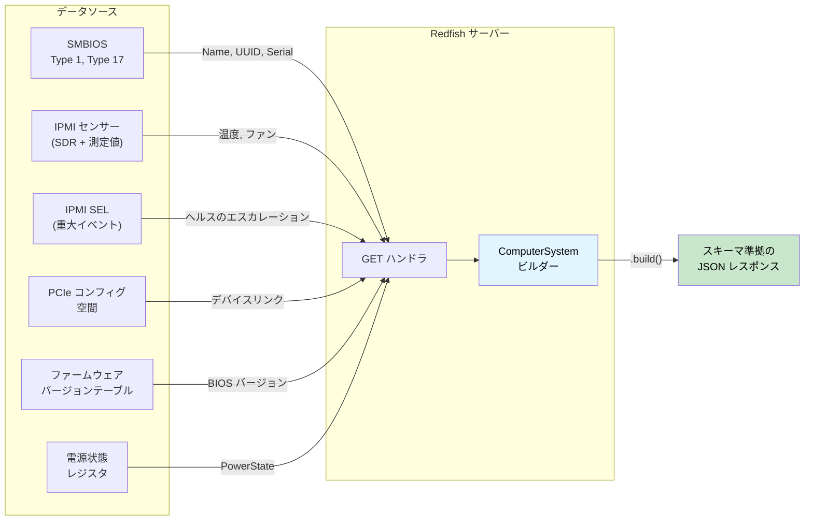

# 実践ウォークスルー — 型安全な Redfish サーバー 🟡

> **学習内容:** レスポンスビルダーの型状態（タイプステート）、データソース利用可能トークン、次元シリアライゼーション、ヘルスロールアップ、スキーマバージョニング、および型付きアクションディスパッチを組み合わせて、**スキーマ非準拠のレスポンスを生成できない** Redfish サーバーを構築する方法を学びます — [第17章](ch17-redfish-applied-walkthrough.md)のクライアントウォークスルーの鏡像（ミラー）となる内容です。
>
> **関連章:** [第2章](ch02-typed-command-interfaces-request-determi.md)（型付きコマンド — アクションディスパッチ用に反転）、[第4章](ch04-capability-tokens-zero-cost-proof-of-aut.md)（ケーパビリティトークン — ソースの利用可能性）、[第6章](ch06-dimensional-analysis-making-the-compiler.md)（次元型 — シリアライズ側）、[第7章](ch07-validated-boundaries-parse-dont-validate.md)（検証済み境界 — 反転: 「シリアライズせず、構築せよ」）、[第9章](ch09-phantom-types-for-resource-tracking.md)（幽霊型 — スキーマバージョニング）、[第11章](ch11-fourteen-tricks-from-the-trenches.md)（裏技3 — `#[non_exhaustive]`、裏技4 — ビルダーの型状態）、[第17章](ch17-redfish-applied-walkthrough.md)（対応するクライアント側）

## 鏡像の問題（The Mirror Problem）

第17章では、「*どのように Redfish を正しく消費するか？*」を問いかけました。本章では、その鏡像となる問いを立てます：「*どのように Redfish を正しく生成するか？*」

クライアント側における危険は、不正なデータを**信用してしまう**ことです。サーバー側における危険は、不正なデータを**送信してしまう**ことです — そしてフリート内のすべてのクライアントが、あなたが送信したデータを信用します。

単一の `GET /redfish/v1/Systems/1` レスポンスは、多くのソースからのデータを融合しなければなりません：



C 言語では、これは6つのサブシステムを呼び出し、`json_object_set()` で手動で JSON ツリーを構築し、すべての必須フィールドが入力されたことを祈る 500 行のハンドラになります。1つでも忘れれば、レスポンスは Redfish スキーマに違反します。単位を間違えれば、すべてのクライアントが破損したテレメトリを目にすることになります。

```c
// C — アセンブリの問題
json_t *get_computer_system(const char *id) {
    json_t *obj = json_object();
    json_object_set_new(obj, "@odata.type",
        json_string("#ComputerSystem.v1_13_0.ComputerSystem"));

    // 🐛 "Name" の設定を忘れた — スキーマで必須
    // 🐛 "UUID" の設定を忘れた — スキーマで必須

    smbios_type1_t *t1 = smbios_get_type1();
    if (t1) {
        json_object_set_new(obj, "Manufacturer",
            json_string(t1->manufacturer));
    }

    json_object_set_new(obj, "PowerState",
        json_string(get_power_state()));  // 少なくともこれは常に利用可能

    // 🐛 読み取り値が生の ADC カウント値であり、摂氏ではない — 捕捉する型がない
    double cpu_temp = read_sensor(SENSOR_CPU_TEMP);
    // この数値は他の場所で Thermal レスポンスに紛れ込む...
    // しかし型レベルで "Celsius" に結びつけるものは何もない

    // 🐛 ヘルスが手動で計算されている — PSU のステータスを含め忘れた
    json_object_set_new(obj, "Status",
        build_status("Enabled", "OK")); // PSU が故障中なので "Critical" にすべき

    return obj; // 2つの必須フィールドが欠落、誤ったヘルス、生の単位
}
```

1つのハンドラに4つのバグがあります。クライアント側では、各バグの影響を受けるのは**1つの**クライアントだけです。サーバー側では、各バグがこの BMC を照会する**すべての**クライアントに影響を与えます。

---

## セクション 1 — レスポンスビルダーの型状態: 「シリアライズせず、構築せよ」（第7章の反転）

第7章では、「バリデーションせず、パースせよ（Parse, don't validate）」— インバウンドデータを一度検証し、その証明を型に保持することを学びました。サーバー側での鏡像は**「シリアライズせず、構築せよ（Construct, don't serialize）」**です — すべての必須フィールドが存在することを条件として `.build()` を有効化するビルダーを介して、アウトバウンドレスポンスを構築します。

```rust,ignore
use std::marker::PhantomData;

// ──── 型レベルのフィールド追跡 ────

pub struct HasField;
pub struct MissingField;

// ──── レスポンスビルダー ────

/// ComputerSystem Redfish リソースのビルダー。
/// 型パラメータは、どの「必須」フィールドが提供されたかを追跡する。
/// オプショナルフィールドには型レベルの追跡は不要。
pub struct ComputerSystemBuilder<Name, Uuid, PowerState, Status> {
    // 必須フィールド — 型レベルで追跡
    name: Option<String>,
    uuid: Option<String>,
    power_state: Option<PowerStateValue>,
    status: Option<ResourceStatus>,
    // オプショナルフィールド — 追跡なし（常に設定可能）
    manufacturer: Option<String>,
    model: Option<String>,
    serial_number: Option<String>,
    bios_version: Option<String>,
    processor_summary: Option<ProcessorSummary>,
    memory_summary: Option<MemorySummary>,
    _markers: PhantomData<(Name, Uuid, PowerState, Status)>,
}

#[derive(Debug, Clone, serde::Serialize)]
pub enum PowerStateValue { On, Off, PoweringOn, PoweringOff }

#[derive(Debug, Clone, serde::Serialize)]
pub struct ResourceStatus {
    #[serde(rename = "State")]
    pub state: StatusState,
    #[serde(rename = "Health")]
    pub health: HealthValue,
    #[serde(rename = "HealthRollup", skip_serializing_if = "Option::is_none")]
    pub health_rollup: Option<HealthValue>,
}

#[derive(Debug, Clone, Copy, serde::Serialize)]
pub enum StatusState { Enabled, Disabled, Absent, StandbyOffline, Starting }

#[derive(Debug, Clone, Copy, PartialEq, Eq, PartialOrd, Ord, serde::Serialize)]
pub enum HealthValue { OK, Warning, Critical }

#[derive(Debug, Clone, serde::Serialize)]
pub struct ProcessorSummary {
    #[serde(rename = "Count")]
    pub count: u32,
    #[serde(rename = "Status")]
    pub status: ResourceStatus,
}

#[derive(Debug, Clone, serde::Serialize)]
pub struct MemorySummary {
    #[serde(rename = "TotalSystemMemoryGiB")]
    pub total_gib: f64,
    #[serde(rename = "Status")]
    pub status: ResourceStatus,
}

// ──── コンストラクタ: すべてのフィールドが MissingField で開始 ────

impl ComputerSystemBuilder<MissingField, MissingField, MissingField, MissingField> {
    pub fn new() -> Self {
        ComputerSystemBuilder {
            name: None, uuid: None, power_state: None, status: None,
            manufacturer: None, model: None, serial_number: None,
            bios_version: None, processor_summary: None, memory_summary: None,
            _markers: PhantomData,
        }
    }
}

// ──── 必須フィールドのセッター — 各セッターが1つの型パラメータを遷移させる ────

impl<U, P, S> ComputerSystemBuilder<MissingField, U, P, S> {
    pub fn name(self, name: String) -> ComputerSystemBuilder<HasField, U, P, S> {
        ComputerSystemBuilder {
            name: Some(name), uuid: self.uuid,
            power_state: self.power_state, status: self.status,
            manufacturer: self.manufacturer, model: self.model,
            serial_number: self.serial_number, bios_version: self.bios_version,
            processor_summary: self.processor_summary,
            memory_summary: self.memory_summary, _markers: PhantomData,
        }
    }
}

impl<N, P, S> ComputerSystemBuilder<N, MissingField, P, S> {
    pub fn uuid(self, uuid: String) -> ComputerSystemBuilder<N, HasField, P, S> {
        ComputerSystemBuilder {
            name: self.name, uuid: Some(uuid),
            power_state: self.power_state, status: self.status,
            manufacturer: self.manufacturer, model: self.model,
            serial_number: self.serial_number, bios_version: self.bios_version,
            processor_summary: self.processor_summary,
            memory_summary: self.memory_summary, _markers: PhantomData,
        }
    }
}

impl<N, U, S> ComputerSystemBuilder<N, U, MissingField, S> {
    pub fn power_state(self, ps: PowerStateValue)
        -> ComputerSystemBuilder<N, U, HasField, S>
    {
        ComputerSystemBuilder {
            name: self.name, uuid: self.uuid,
            power_state: Some(ps), status: self.status,
            manufacturer: self.manufacturer, model: self.model,
            serial_number: self.serial_number, bios_version: self.bios_version,
            processor_summary: self.processor_summary,
            memory_summary: self.memory_summary, _markers: PhantomData,
        }
    }
}

impl<N, U, P> ComputerSystemBuilder<N, U, P, MissingField> {
    pub fn status(self, status: ResourceStatus)
        -> ComputerSystemBuilder<N, U, P, HasField>
    {
        ComputerSystemBuilder {
            name: self.name, uuid: self.uuid,
            power_state: self.power_state, status: Some(status),
            manufacturer: self.manufacturer, model: self.model,
            serial_number: self.serial_number, bios_version: self.bios_version,
            processor_summary: self.processor_summary,
            memory_summary: self.memory_summary, _markers: PhantomData,
        }
    }
}

// ──── オプショナルフィールドのセッター — 任意の状態から利用可能 ────

impl<N, U, P, S> ComputerSystemBuilder<N, U, P, S> {
    pub fn manufacturer(mut self, m: String) -> Self {
        self.manufacturer = Some(m); self
    }
    pub fn model(mut self, m: String) -> Self {
        self.model = Some(m); self
    }
    pub fn serial_number(mut self, s: String) -> Self {
        self.serial_number = Some(s); self
    }
    pub fn bios_version(mut self, v: String) -> Self {
        self.bios_version = Some(v); self
    }
    pub fn processor_summary(mut self, ps: ProcessorSummary) -> Self {
        self.processor_summary = Some(ps); self
    }
    pub fn memory_summary(mut self, ms: MemorySummary) -> Self {
        self.memory_summary = Some(ms); self
    }
}

// ──── .build() はすべての必須フィールドが HasField の場合にのみ存在する ────

impl ComputerSystemBuilder<HasField, HasField, HasField, HasField> {
    pub fn build(self, id: &str) -> serde_json::Value {
        let mut obj = serde_json::json!({
            "@odata.id": format!("/redfish/v1/Systems/{id}"),
            "@odata.type": "#ComputerSystem.v1_13_0.ComputerSystem",
            "Id": id,
            // 型状態によってこれらが Some であることが保証されている — ここでの .unwrap() は安全。
            // 本番コードでは .expect("guaranteed by type state") を推奨。
            "Name": self.name.unwrap(),
            "UUID": self.uuid.unwrap(),
            "PowerState": self.power_state.unwrap(),
            "Status": self.status.unwrap(),
        });

        // オプショナルフィールド — 存在する場合にのみ含める
        if let Some(m) = self.manufacturer {
            obj["Manufacturer"] = serde_json::json!(m);
        }
        if let Some(m) = self.model {
            obj["Model"] = serde_json::json!(m);
        }
        if let Some(s) = self.serial_number {
            obj["SerialNumber"] = serde_json::json!(s);
        }
        if let Some(v) = self.bios_version {
            obj["BiosVersion"] = serde_json::json!(v);
        }
        // 注: 簡潔さのために to_value() に対する .unwrap() を使用している。
        // 本番コードでは `?` を使用してシリアライズエラーを伝播させるべきである。
        if let Some(ps) = self.processor_summary {
            obj["ProcessorSummary"] = serde_json::to_value(ps).unwrap();
        }
        if let Some(ms) = self.memory_summary {
            obj["MemorySummary"] = serde_json::to_value(ms).unwrap();
        }

        obj
    }
}

//
// ── コンパイラが完全性を強制する ──
//
// ✅ すべての必須フィールドが設定されている — .build() が利用可能:
// ComputerSystemBuilder::new()
//     .name("PowerEdge R750".into())
//     .uuid("4c4c4544-...".into())
//     .power_state(PowerStateValue::On)
//     .status(ResourceStatus { ... })
//     .manufacturer("Dell".into())        // オプショナル — 含めて問題ない
//     .build("1")
//
// ❌ "Name" が欠落している — コンパイルエラー:
// ComputerSystemBuilder::new()
//     .uuid("4c4c4544-...".into())
//     .power_state(PowerStateValue::On)
//     .status(ResourceStatus { ... })
//     .build("1")
//   ERROR: method `build` not found for
//   `ComputerSystemBuilder<MissingField, HasField, HasField, HasField>`
```

**排除されたバグクラス:** スキーマ非準拠のレスポンス。ハンドラはすべての必須フィールドを提供しない限り、物理的に `ComputerSystem` をシリアライズできません。コンパイラのエラーメッセージは*どの*フィールドが欠落しているか（`Name` の位置にある `MissingField`）まで正確に教えてくれます。

---

## セクション 2 — ソース利用可能トークン（ケーパビリティトークン、第4章 — 新たな展開）

第4章と第17章において、ケーパビリティトークンは**認可（authorization）**—「呼び出し元がこれを行うことを許可されている」ことを証明しました。サーバー側では、同じパターンが**利用可能性（availability）**—「このデータソースが正常に初期化された」ことを証明します。

BMC が照会する各サブシステムは個別に失敗する可能性があります。SMBIOS テーブルが壊れているかもしれません。センサーサブシステムがまだ初期化中かもしれません。PCIe バスのスキャンがタイムアウトしたかもしれません。それぞれを証明トークンとしてエンコードします：

```rust,ignore
/// SMBIOS テーブルが正常にパースされたことの証明。
/// SMBIOS 初期化関数によってのみ生成される。
pub struct SmbiosReady {
    _private: (),
}

/// IPMI センサーサブシステムが応答することの証明。
pub struct SensorsReady {
    _private: (),
}

/// PCIe バススキャンが完了したことの証明。
pub struct PcieReady {
    _private: (),
}

/// SEL が正常に読み取られたことの証明。
pub struct SelReady {
    _private: (),
}

// ──── データソースの初期化 ────

pub struct SmbiosTables {
    pub product_name: String,
    pub manufacturer: String,
    pub serial_number: String,
    pub uuid: String,
}

pub struct SensorCache {
    pub cpu_temp: Celsius,
    pub inlet_temp: Celsius,
    pub fan_readings: Vec<(String, Rpm)>,
    pub psu_power: Vec<(String, Watts)>,
}

/// リッチな SEL サマリー — 型付きイベントから派生したサブシステムごとのヘルス。
/// 第7章の SEL セクションにおけるコンシューマパイプラインによって構築される。
/// 情報落ちの激しい `has_critical_events: bool` を型付きの粒度に置き換える。
pub struct TypedSelSummary {
    pub total_entries: u32,
    pub processor_health: HealthValue,
    pub memory_health: HealthValue,
    pub power_health: HealthValue,
    pub thermal_health: HealthValue,
    pub fan_health: HealthValue,
    pub storage_health: HealthValue,
    pub security_health: HealthValue,
}

pub fn init_smbios() -> Option<(SmbiosReady, SmbiosTables)> {
    // SMBIOS エントリポイントの読み取り、テーブルのパース...
    // テーブルが存在しないか壊れている場合は None を返す
    Some((
        SmbiosReady { _private: () },
        SmbiosTables {
            product_name: "PowerEdge R750".into(),
            manufacturer: "Dell Inc.".into(),
            serial_number: "SVC1234567".into(),
            uuid: "4c4c4544-004d-5610-804c-b2c04f435031".into(),
        },
    ))
}

pub fn init_sensors() -> Option<(SensorsReady, SensorCache)> {
    // SDR リポジトリの初期化、全センサーの読み取り...
    // IPMI サブシステムが応答しない場合は None を返す
    Some((
        SensorsReady { _private: () },
        SensorCache {
            cpu_temp: Celsius(68.0),
            inlet_temp: Celsius(24.0),
            fan_readings: vec![
                ("Fan1".into(), Rpm(8400)),
                ("Fan2".into(), Rpm(8200)),
            ],
            psu_power: vec![
                ("PSU1".into(), Watts(285.0)),
                ("PSU2".into(), Watts(290.0)),
            ],
        },
    ))
}

pub fn init_sel() -> Option<(SelReady, TypedSelSummary)> {
    // 本番環境では: SEL エントリを読み取り、第7章の TryFrom 経由でパースし、
    // classify_event_health() 経由で分類し、summarize_sel() 経由で集約する。
    Some((
        SelReady { _private: () },
        TypedSelSummary {
            total_entries: 42,
            processor_health: HealthValue::OK,
            memory_health: HealthValue::OK,
            power_health: HealthValue::OK,
            thermal_health: HealthValue::OK,
            fan_health: HealthValue::OK,
            storage_health: HealthValue::OK,
            security_health: HealthValue::OK,
        },
    ))
}
```

データソースからビルダーのフィールドに値を入力する関数は、**対応する証明トークンを要求**するようになります：

```rust,ignore
/// SMBIOS 由来のフィールドを入力する。SMBIOS が利用可能であることの証明が必要。
fn populate_from_smbios<P, S>(
    builder: ComputerSystemBuilder<MissingField, MissingField, P, S>,
    _proof: &SmbiosReady,
    tables: &SmbiosTables,
) -> ComputerSystemBuilder<HasField, HasField, P, S> {
    builder
        .name(tables.product_name.clone())
        .uuid(tables.uuid.clone())
        .manufacturer(tables.manufacturer.clone())
        .serial_number(tables.serial_number.clone())
}

/// SMBIOS が利用できない場合のフォールバック — 必須フィールドを
/// 安全なデフォルト値で入力する。
fn populate_smbios_fallback<P, S>(
    builder: ComputerSystemBuilder<MissingField, MissingField, P, S>,
) -> ComputerSystemBuilder<HasField, HasField, P, S> {
    builder
        .name("Unknown System".into())
        .uuid("00000000-0000-0000-0000-000000000000".into())
}
```

ハンドラは利用可能なトークンに基づいてパスを選択します：

```rust,ignore
fn build_computer_system(
    smbios: &Option<(SmbiosReady, SmbiosTables)>,
    power_state: PowerStateValue,
    health: ResourceStatus,
) -> serde_json::Value {
    let builder = ComputerSystemBuilder::new()
        .power_state(power_state)
        .status(health);

    let builder = match smbios {
        Some((proof, tables)) => populate_from_smbios(builder, proof, tables),
        None => populate_smbios_fallback(builder),
    };

    // どちらのパスも Name と UUID に対して HasField を生成する。
    // いずれにしても .build() は利用可能。
    builder.build("1")
}
```

**排除されたバグクラス:** 初期化に失敗したサブシステムの呼び出し。SMBIOS のパースに失敗した場合、`SmbiosReady` トークンを所持していないため、コンパイラによってフォールバックパスを強制されます。忘れてしまいがちな実行時の `if (smbios != NULL)` は不要です。

### ソース利用可能トークンとケーパビリティミックスインの結合（第8章）

提供する Redfish リソース型が複数ある場合（ComputerSystem、Chassis、Manager、Thermal、Power）、ソースからの入力ロジックがハンドラ間で重複します。第8章の**ミックスイン（mixin）**パターンはこの重複を解消します。ハンドラがどのソースを持っているかを宣言すれば、ブランケット実装（blanket impl）によって値入力メソッドが自動的に提供されます：

```rust,ignore
/// ── データソースのための成分トレイト（第8章） ──

pub trait HasSmbios {
    fn smbios(&self) -> &(SmbiosReady, SmbiosTables);
}

pub trait HasSensors {
    fn sensors(&self) -> &(SensorsReady, SensorCache);
}

pub trait HasSel {
    fn sel(&self) -> &(SelReady, TypedSelSummary);
}

/// ── ミックスイン: SMBIOS + センサーを持つ任意のハンドラが ID 入力を取得 ──

pub trait IdentityMixin: HasSmbios {
    fn populate_identity<P, S>(
        &self,
        builder: ComputerSystemBuilder<MissingField, MissingField, P, S>,
    ) -> ComputerSystemBuilder<HasField, HasField, P, S> {
        let (_, tables) = self.smbios();
        builder
            .name(tables.product_name.clone())
            .uuid(tables.uuid.clone())
            .manufacturer(tables.manufacturer.clone())
            .serial_number(tables.serial_number.clone())
    }
}

/// SMBIOS ケーパビリティを持つ任意の型に対して自動実装。
impl<T: HasSmbios> IdentityMixin for T {}

/// ── ミックスイン: センサー + SEL を持つ任意のハンドラがヘルスロールアップを取得 ──

pub trait HealthMixin: HasSensors + HasSel {
    fn compute_health(&self) -> ResourceStatus {
        let (_, cache) = self.sensors();
        let (_, sel_summary) = self.sel();
        compute_system_health(
            Some(&(SensorsReady { _private: () }, cache.clone())).as_ref(),
            Some(&(SelReady { _private: () }, sel_summary.clone())).as_ref(),
        )
    }
}

impl<T: HasSensors + HasSel> HealthMixin for T {}

/// ── 具象ハンドラは利用可能なソースを所有する ──

struct FullPlatformHandler {
    smbios: (SmbiosReady, SmbiosTables),
    sensors: (SensorsReady, SensorCache),
    sel: (SelReady, TypedSelSummary),
}

impl HasSmbios  for FullPlatformHandler {
    fn smbios(&self) -> &(SmbiosReady, SmbiosTables) { &self.smbios }
}
impl HasSensors for FullPlatformHandler {
    fn sensors(&self) -> &(SensorsReady, SensorCache) { &self.sensors }
}
impl HasSel     for FullPlatformHandler {
    fn sel(&self) -> &(SelReady, TypedSelSummary) { &self.sel }
}

// FullPlatformHandler は自動的に以下を取得する:
//   IdentityMixin::populate_identity()   (HasSmbios 経由)
//   HealthMixin::compute_health()        (HasSensors + HasSel 経由)
//
// HasSensors を実装しているが HasSel を実装していない SensorsOnlyHandler は
// IdentityMixin を取得できるが（SMBIOS を持っている場合）、HealthMixin は取得できない。
// それに対して .compute_health() を呼び出すと → コンパイルエラー。
```

これは第8章の `BaseBoardController` パターンを直接反映しています：成分トレイトが自分が何を持っているかを宣言し、ミックスイントレイトがブランケット実装を通じて振る舞いを提供し、コンパイラが各ミックスインの前提条件をゲートします。新しいデータソース（例: `HasNvme`）とミックスイン（例: `StorageMixin: HasNvme + HasSel`）を追加すると、両方を持つすべてのハンドラにストレージのヘルスロールアップが自動的に付与されます。

---

## セクション 3 — シリアライゼーション境界における次元型（第6章）

クライアント側（第17章§4）では、次元型は °C を RPM として**読み取る**ことを防ぎました。サーバー側では、Celsius の JSON フィールドに RPM を**書き込む**ことを防ぎます。これはより危険です — サーバー上の誤った値は、すべてのクライアントに伝播してしまいます。

```rust,ignore
use serde::Serialize;

// ──── 第6章の次元型（Serialize 付き） ────

#[derive(Debug, Clone, Copy, PartialEq, PartialOrd, Serialize)]
pub struct Celsius(pub f64);

#[derive(Debug, Clone, Copy, PartialEq, PartialOrd, Serialize)]
pub struct Rpm(pub u32);

#[derive(Debug, Clone, Copy, PartialEq, PartialOrd, Serialize)]
pub struct Watts(pub f64);

// ──── Redfish Thermal レスポンスのメンバー ────
// フィールドの型によって、どの単位がどの JSON プロパティに属するかが強制される。

#[derive(Serialize)]
#[serde(rename_all = "PascalCase")]
pub struct TemperatureMember {
    pub member_id: String,
    pub name: String,
    pub reading_celsius: Celsius,           // ← Celsius でなければならない
    #[serde(skip_serializing_if = "Option::is_none")]
    pub upper_threshold_critical: Option<Celsius>,
    #[serde(skip_serializing_if = "Option::is_none")]
    pub upper_threshold_fatal: Option<Celsius>,
    pub status: ResourceStatus,
}

#[derive(Serialize)]
#[serde(rename_all = "PascalCase")]
pub struct FanMember {
    pub member_id: String,
    pub name: String,
    pub reading: Rpm,                       // ← Rpm でなければならない
    pub reading_units: &'static str,        // 常に "RPM"
    pub status: ResourceStatus,
}

#[derive(Serialize)]
#[serde(rename_all = "PascalCase")]
pub struct PowerControlMember {
    pub member_id: String,
    pub name: String,
    pub power_consumed_watts: Watts,        // ← Watts でなければならない
    #[serde(skip_serializing_if = "Option::is_none")]
    pub power_capacity_watts: Option<Watts>,
    pub status: ResourceStatus,
}

// ──── センサーキャッシュからの Thermal レスポンスの構築 ────

fn build_thermal_response(
    _proof: &SensorsReady,
    cache: &SensorCache,
) -> serde_json::Value {
    let temps = vec![
        TemperatureMember {
            member_id: "0".into(),
            name: "CPU Temp".into(),
            reading_celsius: cache.cpu_temp,     // Celsius → Celsius ✅
            upper_threshold_critical: Some(Celsius(95.0)),
            upper_threshold_fatal: Some(Celsius(105.0)),
            status: ResourceStatus {
                state: StatusState::Enabled,
                health: if cache.cpu_temp < Celsius(95.0) {
                    HealthValue::OK
                } else {
                    HealthValue::Critical
                },
                health_rollup: None,
            },
        },
        TemperatureMember {
            member_id: "1".into(),
            name: "Inlet Temp".into(),
            reading_celsius: cache.inlet_temp,   // Celsius → Celsius ✅
            upper_threshold_critical: Some(Celsius(42.0)),
            upper_threshold_fatal: None,
            status: ResourceStatus {
                state: StatusState::Enabled,
                health: HealthValue::OK,
                health_rollup: None,
            },
        },

        // ❌ コンパイルエラー — Celsius フィールドに Rpm を設定できない:
        // TemperatureMember {
        //     reading_celsius: cache.fan_readings[0].1,  // Rpm ≠ Celsius
        //     ...
        // }
    ];

    let fans: Vec<FanMember> = cache.fan_readings.iter().enumerate().map(|(i, (name, rpm))| {
        FanMember {
            member_id: i.to_string(),
            name: name.clone(),
            reading: *rpm,                       // Rpm → Rpm ✅
            reading_units: "RPM",
            status: ResourceStatus {
                state: StatusState::Enabled,
                health: if *rpm > Rpm(1000) { HealthValue::OK } else { HealthValue::Critical },
                health_rollup: None,
            },
        }
    }).collect();

    serde_json::json!({
        "@odata.type": "#Thermal.v1_7_0.Thermal",
        "Temperatures": temps,
        "Fans": fans,
    })
}
```

**排除されたバグクラス:** シリアライズ時の単位の混同。Redfish スキーマは `ReadingCelsius` が °C であると定めています。Rust の型システムは `reading_celsius` が `Celsius` でなければならないと定めます。開発者が誤って `Rpm(8400)` や `Watts(285.0)` を渡してしまった場合、コンパイラはその値が JSON に到達する前に捕捉します。

---

## セクション 4 — 型付きフォールド（Fold）としてのヘルスロールアップ

Redfish の `Status.Health` は*ロールアップ*（集約値）です — すべてのサブコンポーネントの中で最も悪い状態を反映します。C 言語では、これは通常、ソースを見落としがちな一連の `if` チェックになります。型付き enum と `Ord` を使えば、ロールアップは1行の fold になり、コンパイラはすべてのソースが寄与することを保証します：

```rust,ignore
/// 複数のソースからヘルスをロールアップ（集約）する。
/// HealthValue の Ord: OK < Warning < Critical。
/// 最も悪い（最大の）値を返す。
fn rollup(sources: &[HealthValue]) -> HealthValue {
    sources.iter().copied().max().unwrap_or(HealthValue::OK)
}

/// すべてのサブコンポーネントからシステムレベルのヘルスを計算する。
/// すべてのソースへの明示的な参照を受け取る — 呼び出し元はそれら「すべて」を提供しなければならない。
fn compute_system_health(
    sensors: Option<&(SensorsReady, SensorCache)>,
    sel: Option<&(SelReady, TypedSelSummary)>,
) -> ResourceStatus {
    let mut inputs = Vec::new();

    // ── ライブセンサーの測定値 ──
    if let Some((_proof, cache)) = sensors {
        // 温度のヘルス（次元: Celsius による比較）
        if cache.cpu_temp > Celsius(95.0) {
            inputs.push(HealthValue::Critical);
        } else if cache.cpu_temp > Celsius(85.0) {
            inputs.push(HealthValue::Warning);
        } else {
            inputs.push(HealthValue::OK);
        }

        // ファンのヘルス（次元: Rpm による比較）
        for (_name, rpm) in &cache.fan_readings {
            if *rpm < Rpm(500) {
                inputs.push(HealthValue::Critical);
            } else if *rpm < Rpm(1000) {
                inputs.push(HealthValue::Warning);
            } else {
                inputs.push(HealthValue::OK);
            }
        }

        // PSU のヘルス（次元: Watts による比較）
        for (_name, watts) in &cache.psu_power {
            if *watts > Watts(800.0) {
                inputs.push(HealthValue::Critical);
            } else {
                inputs.push(HealthValue::OK);
            }
        }
    }

    // ── SEL のサブシステムごとのヘルス（第7章の TypedSelSummary より） ──
    // 各サブシステムのヘルスは、すべてのセンサー型とイベントバリアントに対する
    // 網羅的なマッチングによって導出されたもの。情報は一切失われていない。
    if let Some((_proof, sel_summary)) = sel {
        inputs.push(sel_summary.processor_health);
        inputs.push(sel_summary.memory_health);
        inputs.push(sel_summary.power_health);
        inputs.push(sel_summary.thermal_health);
        inputs.push(sel_summary.fan_health);
        inputs.push(sel_summary.storage_health);
        inputs.push(sel_summary.security_health);
    }

    let health = rollup(&inputs);

    ResourceStatus {
        state: StatusState::Enabled,
        health,
        health_rollup: Some(health),
    }
}
```

**排除されたバグクラス:** 不完全なヘルスロールアップ。C 言語では、ヘルスの計算に PSU のステータスを含め忘れることはサイレントなバグです — PSU が故障しているのにシステムは「OK」を報告してしまいます。ここでは、`compute_system_health` はすべてのデータソースへの明示的な参照を取ります。SEL の寄与もはや情報落ちした `bool` ではなく、第7章のコンシューマパイプラインで網羅的にマッチングされた7つのサブシステムごとの `HealthValue` フィールドです。新しい SEL センサー型を追加すると分類器での処理が強制され、新しいサブシステムフィールドを追加するとロールアップへの追加が強制されます。

---

## セクション 5 — 幽霊型によるスキーマバージョニング（第9章）

BMC が `ComputerSystem.v1_13_0` を公表（アドバタイズ）する場合、レスポンスにはそのスキーマバージョンで導入されたプロパティ（`LastResetTime`、`BootProgress`）が**必ず**含まれていなければなりません。これらのフィールドなしで v1.13 を公表することは、Redfish Interop Validator での違反（失敗）になります。幽霊型によるバージョンマーカーは、これをコンパイル時の契約にします：

```rust,ignore
use std::marker::PhantomData;

// ──── スキーマバージョンマーカー ────

pub struct V1_5;
pub struct V1_13;

// ──── バージョン認識レスポンス ────

pub struct ComputerSystemResponse<V> {
    pub base: ComputerSystemBase,
    _version: PhantomData<V>,
}

pub struct ComputerSystemBase {
    pub id: String,
    pub name: String,
    pub uuid: String,
    pub power_state: PowerStateValue,
    pub status: ResourceStatus,
    pub manufacturer: Option<String>,
    pub serial_number: Option<String>,
    pub bios_version: Option<String>,
}

// すべてのバージョンで利用可能なメソッド:
impl<V> ComputerSystemResponse<V> {
    pub fn base_json(&self) -> serde_json::Value {
        serde_json::json!({
            "Id": self.base.id,
            "Name": self.base.name,
            "UUID": self.base.uuid,
            "PowerState": self.base.power_state,
            "Status": self.base.status,
        })
    }
}

// ──── v1.13 固有のフィールド ────

/// 最後のシステムリセットの日時。
pub struct LastResetTime(pub String);

/// ブート進行情報。
pub struct BootProgress {
    pub last_state: String,
    pub last_state_time: String,
}

impl ComputerSystemResponse<V1_13> {
    /// LastResetTime — v1.13+ で必須。
    /// このメソッドは V1_13 にのみ存在する。BMC が v1.13 を公表しているのに
    /// ハンドラがこれを呼び出さない場合、フィールドが欠落する。
    pub fn last_reset_time(&self) -> LastResetTime {
        // RTC またはブートタイムスタンプレジスタから読み取る
        LastResetTime("2026-03-16T08:30:00Z".to_string())
    }

    /// BootProgress — v1.13+ で必須。
    pub fn boot_progress(&self) -> BootProgress {
        BootProgress {
            last_state: "OSRunning".to_string(),
            last_state_time: "2026-03-16T08:32:00Z".to_string(),
        }
    }

    /// バージョン固有のフィールドを含む、完全な v1.13 JSON レスポンスを構築する。
    pub fn to_json(&self) -> serde_json::Value {
        let mut obj = self.base_json();
        obj["@odata.type"] =
            serde_json::json!("#ComputerSystem.v1_13_0.ComputerSystem");

        let reset_time = self.last_reset_time();
        obj["LastResetTime"] = serde_json::json!(reset_time.0);

        let boot = self.boot_progress();
        obj["BootProgress"] = serde_json::json!({
            "LastState": boot.last_state,
            "LastStateTime": boot.last_state_time,
        });

        obj
    }
}

impl ComputerSystemResponse<V1_5> {
    /// v1.5 JSON — LastResetTime なし、BootProgress なし。
    pub fn to_json(&self) -> serde_json::Value {
        let mut obj = self.base_json();
        obj["@odata.type"] =
            serde_json::json!("#ComputerSystem.v1_5_0.ComputerSystem");
        obj
    }

    // last_reset_time() はここには存在しない。
    // 呼び出すと → コンパイルエラー:
    //   let resp: ComputerSystemResponse<V1_5> = ...;
    //   resp.last_reset_time();
    //   ❌ ERROR: method `last_reset_time` not found for
    //            `ComputerSystemResponse<V1_5>`
}
```

**排除されたバグクラス:** スキーマバージョンの不一致。BMC が v1.13 を公表するように設定されている場合、`ComputerSystemResponse<V1_13>` を使用すると、コンパイラはすべての v1.13 必須フィールドが生成されることを保証します。v1.5 にダウングレードしますか？型パラメータを変更するだけです — v1.13 メソッドが消滅し、無用なフィールドがレスポンスに漏洩することはありません。

---

## セクション 6 — 型付きアクションディスパッチ（第2章の反転）

第2章では、型付きコマンドパターンは**クライアント**側で `Request → Response` を結びつけました。**サーバー**側では、同じパターンが入ってくるアクションペイロードを検証し、型安全にディスパッチします — 逆方向の適用です。

```rust,ignore
use serde::Deserialize;

// ──── アクションのトレイト（第2章の IpmiCmd トレイトの鏡像） ────

/// Redfish アクション: フレームワークが POST ボディから Params をデシリアライズし、
/// その後 execute() を呼び出す。JSON が Params と一致しない場合、
/// デシリアライズは失敗し、不正な入力で execute() が呼び出されることは決してない。
pub trait RedfishAction {
    /// 期待される JSON ボディ構造。
    type Params: serde::de::DeserializeOwned;
    /// アクション実行の結果。
    type Result: serde::Serialize;

    fn execute(&self, params: Self::Params) -> Result<Self::Result, RedfishError>;
}

#[derive(Debug)]
pub enum RedfishError {
    InvalidPayload(String),
    ActionFailed(String),
}

// ──── ComputerSystem.Reset ────

pub struct ComputerSystemReset;

#[derive(Debug, Deserialize)]
pub enum ResetType {
    On,
    ForceOff,
    GracefulShutdown,
    GracefulRestart,
    ForceRestart,
    ForceOn,
    PushPowerButton,
}

#[derive(Debug, Deserialize)]
#[serde(rename_all = "PascalCase")]
pub struct ResetParams {
    pub reset_type: ResetType,
}

impl RedfishAction for ComputerSystemReset {
    type Params = ResetParams;
    type Result = ();

    fn execute(&self, params: ResetParams) -> Result<(), RedfishError> {
        match params.reset_type {
            ResetType::GracefulShutdown => {
                // ホストへ ACPI シャットダウンを送信
                println!("Initiating ACPI shutdown");
                Ok(())
            }
            ResetType::ForceOff => {
                // ホストへ電源オフをアサート
                println!("Forcing power off");
                Ok(())
            }
            ResetType::On | ResetType::ForceOn => {
                println!("Powering on");
                Ok(())
            }
            ResetType::GracefulRestart => {
                println!("ACPI restart");
                Ok(())
            }
            ResetType::ForceRestart => {
                println!("Forced restart");
                Ok(())
            }
            ResetType::PushPowerButton => {
                println!("Simulating power button press");
                Ok(())
            }
            // 網羅的 — コンパイラが欠落したバリアントを捕捉する
        }
    }
}

// ──── Manager.ResetToDefaults ────

pub struct ManagerResetToDefaults;

#[derive(Debug, Deserialize)]
pub enum ResetToDefaultsType {
    ResetAll,
    PreserveNetworkAndUsers,
    PreserveNetwork,
}

#[derive(Debug, Deserialize)]
#[serde(rename_all = "PascalCase")]
pub struct ResetToDefaultsParams {
    pub reset_to_defaults_type: ResetToDefaultsType,
}

impl RedfishAction for ManagerResetToDefaults {
    type Params = ResetToDefaultsParams;
    type Result = ();

    fn execute(&self, params: ResetToDefaultsParams) -> Result<(), RedfishError> {
        match params.reset_to_defaults_type {
            ResetToDefaultsType::ResetAll => {
                println!("Full factory reset");
                Ok(())
            }
            ResetToDefaultsType::PreserveNetworkAndUsers => {
                println!("Reset preserving network + users");
                Ok(())
            }
            ResetToDefaultsType::PreserveNetwork => {
                println!("Reset preserving network config");
                Ok(())
            }
        }
    }
}

// ──── ジェネリックなアクションディスパッチャ ────

fn dispatch_action<A: RedfishAction>(
    action: &A,
    raw_body: &str,
) -> Result<A::Result, RedfishError> {
    // デシリアライゼーションによってペイロードの構造が検証される。
    // JSON が A::Params と一致しない場合、これは失敗し、
    // execute() が呼び出されることは決してない。
    let params: A::Params = serde_json::from_str(raw_body)
        .map_err(|e| RedfishError::InvalidPayload(e.to_string()))?;

    action.execute(params)
}

// ── 使用例 ──

fn handle_reset_action(body: &str) -> Result<(), RedfishError> {
    // 型安全: ResetParams は execute() の前に serde によって検証される
    dispatch_action(&ComputerSystemReset, body)?;
    Ok(())

    // 不正な JSON: {"ResetType": "Explode"}
    // → serde エラー: "unknown variant `Explode`"
    // → execute() は決して呼び出されない

    // 欠落したフィールド: {}
    // → serde エラー: "missing field `ResetType`"
    // → execute() は決して呼び出されない
}
```

**排除されたバグクラス:**
- **不正なアクションペイロード:** serde は `execute()` が呼び出される前に、未知の enum バリアントや欠落したフィールドを拒否します。手動の `if (body["ResetType"] == ...)` チェーンは不要です。
- **バリアント処理の欠落:** `match params.reset_type` は網羅的です — 新しい `ResetType` バリアントを追加すると、すべてのアクションハンドラの更新が強制されます。
- **型の混同:** `ComputerSystemReset` は `ResetParams` を期待し、`ManagerResetToDefaults` は `ResetToDefaultsParams` を期待します。トレイトシステムにより、あるアクションのパラメータを別のアクションのハンドラに渡すことは防止されます。

---

## セクション 7 — すべてを組み合わせる: GET ハンドラ

6つのセクションすべてを単一のスキーマ準拠レスポンスへと統合する完全なハンドラは次のとおりです：

```rust,ignore
/// 完全な GET /redfish/v1/Systems/1 ハンドラ。
///
/// すべての必須フィールドはビルダーの型状態によって強制される。
/// すべてのデータソースは利用可能トークンによってゲートされる。
/// すべての単位は次元型に固定される。
/// すべてのヘルス入力が型付きロールアップに供給される。
fn handle_get_computer_system(
    smbios: &Option<(SmbiosReady, SmbiosTables)>,
    sensors: &Option<(SensorsReady, SensorCache)>,
    sel: &Option<(SelReady, TypedSelSummary)>,
    power_state: PowerStateValue,
    bios_version: Option<String>,
) -> serde_json::Value {
    // ── 1. ヘルスロールアップ（セクション 4） ──
    // センサー + SEL からのヘルスを単一の型付きステータスにフォールドする
    let health = compute_system_health(
        sensors.as_ref(),
        sel.as_ref(),
    );

    // ── 2. ビルダーの型状態（セクション 1） ──
    let builder = ComputerSystemBuilder::new()
        .power_state(power_state)
        .status(health);

    // ── 3. ソース利用可能トークン（セクション 2） ──
    let builder = match smbios {
        Some((proof, tables)) => {
            // SMBIOS 利用可能 — ハードウェアから入力
            populate_from_smbios(builder, proof, tables)
        }
        None => {
            // SMBIOS 利用不可 — 安全なデフォルト値
            populate_smbios_fallback(builder)
        }
    };

    // ── 4. センサーからのオプショナルな情報付加（セクション 3） ──
    let builder = if let Some((_proof, cache)) = sensors {
        builder
            .processor_summary(ProcessorSummary {
                count: 2,
                status: ResourceStatus {
                    state: StatusState::Enabled,
                    health: if cache.cpu_temp < Celsius(95.0) {
                        HealthValue::OK
                    } else {
                        HealthValue::Critical
                    },
                    health_rollup: None,
                },
            })
    } else {
        builder
    };

    let builder = match bios_version {
        Some(v) => builder.bios_version(v),
        None => builder,
    };

    // ── 5. ビルド（セクション 1） ──
    // 両方のパス（SMBIOS の有無）が Name と UUID に対して HasField を
    // 生成するため、.build() が利用可能。コンパイラがこれを検証済み。
    builder.build("1")
}

// ──── サーバーの起動 ────

fn main() {
    // すべてのデータソースを初期化 — 各ソースが利用可能トークンを返す
    let smbios = init_smbios();
    let sensors = init_sensors();
    let sel = init_sel();

    // ハンドラ呼び出しのシミュレーション
    let response = handle_get_computer_system(
        &smbios,
        &sensors,
        &sel,
        PowerStateValue::On,
        Some("2.10.1".into()),
    );

    // 注: 簡潔さのために .unwrap() を使用 — 本番環境では適切にエラー処理を行うこと。
    println!("{}", serde_json::to_string_pretty(&response).unwrap());
}
```

**期待される出力:**

```json
{
  "@odata.id": "/redfish/v1/Systems/1",
  "@odata.type": "#ComputerSystem.v1_13_0.ComputerSystem",
  "Id": "1",
  "Name": "PowerEdge R750",
  "UUID": "4c4c4544-004d-5610-804c-b2c04f435031",
  "PowerState": "On",
  "Status": {
    "State": "Enabled",
    "Health": "OK",
    "HealthRollup": "OK"
  },
  "Manufacturer": "Dell Inc.",
  "SerialNumber": "SVC1234567",
  "BiosVersion": "2.10.1",
  "ProcessorSummary": {
    "Count": 2,
    "Status": {
      "State": "Enabled",
      "Health": "OK"
    }
  }
}
```

### コンパイラが証明するもの（サーバー側）

| # | バグクラス | 防ぐ方法 | パターン（セクション） |
|---|-----------|-------------------|-------------------|
| 1 | レスポンス内の必須フィールド欠落 | `.build()` はすべての型状態マーカーが `HasField` であることを要求 | ビルダーの型状態（§1） |
| 2 | 失敗したサブシステムの呼び出し | ソース利用可能トークンがデータアクセスをゲート | ケーパビリティトークン（§2） |
| 3 | 利用不可ソースに対するフォールバック欠落 | 両方の `match` アーム（存在/不在）が `HasField` を生成しなければならない | 型状態 + 網羅的マッチ（§2） |
| 4 | JSON フィールド内の誤った単位 | `reading_celsius: Celsius` ≠ `Rpm` ≠ `Watts` | 次元型（§3） |
| 5 | 不完全なヘルスロールアップ | `compute_system_health` は明示的なソース参照を取る。SEL は第7章の `TypedSelSummary` を通じてサブシステムごとの `HealthValue` を提供 | 型付き関数シグネチャ + 網羅的マッチ（§4） |
| 6 | スキーマバージョンの不一致 | `ComputerSystemResponse<V1_13>` には `last_reset_time()` があり、`V1_5` にはない | 幽霊型（§5） |
| 7 | 不正なアクションペイロードの受理 | serde が `execute()` の前に未知/欠落フィールドを拒否 | 型付きアクションディスパッチ（§6） |
| 8 | アクションバリアントの処理漏れ | `match params.reset_type` は網羅的 | Enum の網羅性（§6） |
| 9 | 誤ったハンドラへの誤ったアクションパラメータ | `RedfishAction::Params` は関連型 | 型付きコマンドの反転（§6） |

**総実行時オーバーヘッド: ゼロ。** ビルダーマーカー、利用可能トークン、幽霊バージョン型、次元ニュータイプはすべてコンパイル時に消去されます。生成される JSON は、手書きの C バージョンと同一です — 9種類ものバグクラスが排除されている点を除けば。

---

## 鏡像: クライアントとサーバーのパターン対応表

| 関心事 | クライアント（第17章） | サーバー（本章） |
|---------|---------------|----------------------|
| **境界の方向** | インバウンド: JSON → 型付きの値 | アウトバウンド: 型付きの値 → JSON |
| **中核の原則** | 「バリデーションせず、パースせよ」 | 「シリアライズせず、構築せよ」 |
| **フィールドの完全性** | `TryFrom` が必須フィールドの存在を検証 | ビルダーの型状態が必須フィールドを条件に `.build()` をゲート |
| **単位の安全性** | 読み取り時に `Celsius` ≠ `Rpm` | 書き込み時に `Celsius` ≠ `Rpm` |
| **権限 / 利用可能性** | ケーパビリティトークンがリクエストをゲート | 利用可能トークンがデータソースへのアクセスをゲート |
| **データソース** | 単一ソース（BMC） | 複数ソース（SMBIOS、センサー、SEL、PCIe、...） |
| **スキーマバージョン** | 幽霊型が未サポートフィールドへのアクセスを防止 | 幽霊型がバージョン必須フィールドの提供を強制 |
| **アクション** | クライアントが型付きアクション POST を送信 | サーバーが `RedfishAction` トレイト経由で検証・ディスパッチ |
| **ヘルス** | `Status.Health` を読み取って信用する | 型付きロールアップ経由で `Status.Health` を計算する |
| **障害の伝播** | 1つの不正なパース → 1つのクライアントエラー | 1つの不正なシリアライズ → 全クライアントが誤ったデータを見る |

この2つの章は完全なストーリーを形成しています。第17章：「*消費するすべてのレスポンスが型チェックされる。*」本章：「*生成するすべてのレスポンスが型チェックされる。*」同じパターンが両方向に流れます — 型システムはネットワークケーブルのどちら側にいるかを関知しません。

## 主なポイント

1. **「シリアライズせず、構築せよ」**は、「バリデーションせず、パースせよ」のサーバー側の鏡像です — ビルダーの型状態を使用して、すべての必須フィールドが存在する場合にのみ `.build()` が呼び出せるようにします。
2. **ソース利用可能トークンは初期化を証明する** — 第4章のケーパビリティトークンパターンと同じものを、データソースの準備ができていることの証明として再利用します。
3. **次元型は生成者と消費者の双方を保護する** — `ReadingCelsius` フィールドに `Rpm` を渡すことは、顧客から報告されるバグではなくコンパイルエラーになります。
4. **ヘルスロールアップは型付きフォールド（Fold）である** — `HealthValue` の `Ord` と明示的なソース参照により、コンパイラは「PSU ステータスの含め忘れ」を捕捉します。
5. **型レベルでのスキーマバージョニング** — 幽霊型パラメータにより、バージョン固有のフィールドがコンパイル時に出現・消滅します。
6. **アクションディスパッチは第2章を反転させたもの** — `serde` がペイロードを型付きの `Params` 構造体にデシリアライズし、enum バリアントに対する網羅的マッチングにより、新しい `ResetType` の追加時にすべてのハンドラの更新が強制されます。
7. **サーバー側のバグはすべてのクライアントに伝播する** — だからこそ、生成者側におけるコンパイル時の正しさは、消費者側よりもさらに重要なのです。
